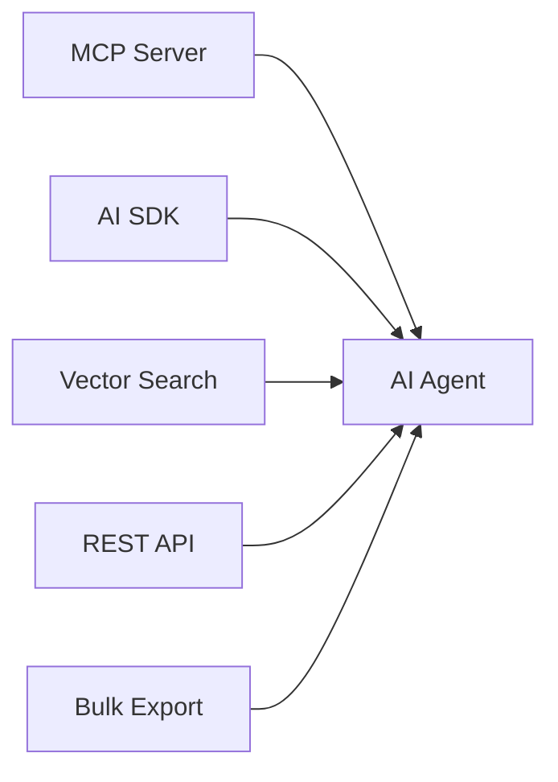

## Abstract

The Access Layer is Elastic Studio's primary differentiator: agent-native interfaces for consuming verified data. Unlike traditional labeling platforms that provide batch exports for human data scientists, Elastic Studio is built for machine-to-machine interaction—MCP servers for LLM toolchains, AI SDK integrations, real-time vector search, and per-query micropayments.

---

## 1. Agent-First Access Hierarchy

Access methods are prioritized for agent consumption:



| Method | Latency | Best For | Verification |
|--------|---------|----------|--------------|
| MCP Server | ~10ms (local) | LLM toolchains | Full proofs |
| AI SDK | ~50ms | Agent tool calls | Full proofs |
| Vector Search | ~50ms | RAG retrieval | Quality metadata |
| REST API | ~100ms | Backend services | Optional proofs |
| Bulk Export | Minutes | ML training | Metadata only |

---

## 2. MCP Server (Primary)

### 2.1 Overview

The Model Context Protocol (MCP) is the recommended integration for AI agents. It provides:

- Native integration with Claude, Cursor, and MCP-compatible tools
- Bidirectional communication (not just request-response)
- Built-in context management for LLMs
- Real-time verification proofs

### 2.2 Quick Start

**Installation:**

```bash
npm install -g @elastic-studio/mcp-server
```

**Configuration (Claude Desktop / Cursor):**

```json
{
  "mcpServers": {
    "elastic-studio": {
      "command": "elastic-studio-mcp",
      "env": {
        "ELASTIC_API_KEY": "es_live_xxxx"
      }
    }
  }
}
```

### 2.3 Available Tools

| Tool | Description | Use Case |
|------|-------------|----------|
| `search_verified_data` | Semantic search with quality filters | RAG, fact retrieval |
| `get_data_with_proof` | Retrieve record + verification proof | Tool response verification |
| `verify_claim` | Check if a claim is verified | Agent grounding |
| `list_datasets` | Browse available datasets | Discovery |

**Tool Schema Examples:**

```typescript
// search_verified_data
{
  name: "search_verified_data",
  description: "Search for consensus-verified data",
  inputSchema: {
    type: "object",
    properties: {
      query: { type: "string" },
      min_confidence: { type: "number", default: 0.7 },
      limit: { type: "number", default: 10 }
    },
    required: ["query"]
  }
}

// get_data_with_proof
{
  name: "get_data_with_proof",
  description: "Get data with cryptographic verification proof",
  inputSchema: {
    type: "object",
    properties: {
      record_id: { type: "string" }
    },
    required: ["record_id"]
  }
}
```

### 2.4 Resources

| URI | Description |
|-----|-------------|
| `elastic://datasets` | All accessible datasets |
| `elastic://datasets/{id}` | Dataset metadata |
| `elastic://records/{id}` | Individual record |

---

## 3. AI SDK Integration

### 3.1 OpenAI Function Calling

```python
from openai import OpenAI
from elastic_studio import ElasticClient

client = OpenAI()
elastic = ElasticClient(api_key="...")

tools = [{
    "type": "function",
    "function": {
        "name": "search_verified_data",
        "description": "Search Elastic Studio for verified data",
        "parameters": {
            "type": "object",
            "properties": {
                "query": {"type": "string"},
                "min_confidence": {"type": "number"}
            },
            "required": ["query"]
        }
    }
}]

response = client.chat.completions.create(
    model="gpt-4",
    messages=[...],
    tools=tools
)

# Handle tool call
if response.choices[0].message.tool_calls:
    args = json.loads(response.choices[0].message.tool_calls[0].function.arguments)
    results = elastic.search(query=args["query"])
```

### 3.2 Anthropic Tool Use

```python
import anthropic
from elastic_studio import ElasticClient

client = anthropic.Anthropic()
elastic = ElasticClient(api_key="...")

tools = [{
    "name": "query_verified_data",
    "description": "Query verified data from Elastic Studio",
    "input_schema": {
        "type": "object",
        "properties": {
            "query": {"type": "string"},
            "require_proof": {"type": "boolean"}
        },
        "required": ["query"]
    }
}]

response = client.messages.create(
    model="claude-sonnet-4-20250514",
    tools=tools,
    messages=[...]
)
```

### 3.3 DeepSeek Integration

DeepSeek uses OpenAI-compatible API:

```python
from openai import OpenAI

client = OpenAI(
    api_key="deepseek-key",
    base_url="https://api.deepseek.com"
)

# Same function calling pattern as OpenAI
```

---

## 4. Vector Search API

### 4.1 Endpoint

`POST /v1/vectors/search`

### 4.2 Request Format

```json
{
  "query": "What are the authentication best practices?",
  "filters": {
    "min_confidence": 0.8,
    "max_age_days": 30,
    "data_type": "text"
  },
  "limit": 10,
  "include_proof": true
}
```

### 4.3 Response Format

```json
{
  "results": [
    {
      "id": "rec_abc123",
      "content": "...",
      "label": {
        "category": "best_practice",
        "confidence": 0.92
      },
      "verification": {
        "consensus_score": 0.95,
        "labeler_count": 5,
        "proof": {
          "merkle_root": "0x...",
          "block_number": 12345678
        }
      },
      "similarity": 0.89
    }
  ]
}
```

### 4.4 Filter Operators

| Operator | Example | Description |
|----------|---------|-------------|
| `$eq` | `{"label": {"$eq": "positive"}}` | Exact match |
| `$gt` | `{"confidence": {"$gt": 0.9}}` | Greater than |
| `$gte` | `{"confidence": {"$gte": 0.8}}` | Greater or equal |
| `$in` | `{"label": {"$in": ["a", "b"]}}` | In array |

---

## 5. REST API

### 5.1 Base Configuration

| Property | Value |
|----------|-------|
| Base URL | `https://api.elasticstudio.io/v1` |
| Protocol | HTTPS (TLS 1.3) |
| Format | JSON |

### 5.2 Authentication

```
Authorization: Bearer es_live_xxxx
```

### 5.3 Key Endpoints

| Endpoint | Method | Description |
|----------|--------|-------------|
| `/datasets` | GET | List datasets |
| `/datasets/{id}/records` | GET | Get records |
| `/search` | POST | Semantic search |
| `/records/{id}/proof` | GET | Get verification proof |
| `/export` | POST | Bulk export (async) |

---

## 6. Verification Proofs

### 6.1 Proof Structure

Every response can include a cryptographic verification proof:

```typescript
interface VerificationProof {
  // Merkle proof
  merkle_root: string;      // Root hash (on-chain)
  proof_path: string[];     // Siblings for verification
  leaf_hash: string;        // Hash of this record
  
  // On-chain reference
  block_number: number;     // Attestation block
  tx_hash: string;          // Transaction hash
  
  // Metadata
  consensus_timestamp: string;
  labeler_count: number;
  consensus_score: number;
}
```

### 6.2 Verifying Proofs

```python
from elastic_studio import verify_proof

result = elastic.get_data_with_proof(record_id)

is_valid = verify_proof(
    content=result.content,
    label=result.label,
    proof=result.verification.proof
)

if not is_valid:
    raise SecurityError("Verification failed")
```

---

## 7. Payment Models

### 7.1 Current Model (Token Balance)

| Operation | Cost (ELASTIC) |
|-----------|----------------|
| Search query | 0.005 |
| Record retrieval | 0.001 |
| Verification proof | 0.002 |
| Vector search | 0.005 |

Minimum balance: 100 ELASTIC

### 7.2 x402 Micropayments (Coming Soon)

Future integration with the x402 protocol enables true per-query payments:

```
Agent ──▶ Request + x402 header ──▶ Elastic Studio
      ◀── 402 Payment Required ◀──
      ──▶ Payment proof ──▶
      ◀── Data + Verification ◀──
```

**Benefits:**
- No subscription or minimum balance
- Pay only for data consumed
- Automatic royalty distribution to labelers
- Privacy-preserving payment proofs

---

## 8. Rate Limits

| Plan | Requests/min | Vector/min | Concurrent |
|------|--------------|------------|------------|
| Free | 10 | 5 | 2 |
| Starter | 100 | 50 | 10 |
| Pro | 1,000 | 500 | 50 |
| Enterprise | Custom | Custom | Custom |

**Headers:**
- `X-RateLimit-Limit`
- `X-RateLimit-Remaining`
- `X-RateLimit-Reset`

---

## 9. SDK Reference

| Language | Package | Status |
|----------|---------|--------|
| Python | `elastic-studio` | Available |
| TypeScript | `@elastic-studio/sdk` | Available |
| Go | `github.com/elastic-studio/go-sdk` | Beta |

**Python Quick Start:**

```python
from elastic_studio import ElasticClient

client = ElasticClient(api_key="es_live_xxxx")

# Search with quality filters
results = client.search(
    query="authentication best practices",
    min_confidence=0.8,
    include_proof=True
)

for result in results:
    print(f"Content: {result.content}")
    print(f"Confidence: {result.verification.consensus_score}")
    print(f"Proof valid: {result.verify()}")
```

---

## 10. Next Steps

For detailed integration guides, see:

- [Agent Integrations](/elastic-studio/agent-integrations) — Comprehensive MCP and SDK documentation
- [Agent Use Cases](/elastic-studio/agent-use-cases) — RAG, grounding, and verification patterns
- [ZK Access Layer](/elastic-studio/zk-access) — Privacy-preserving data access
