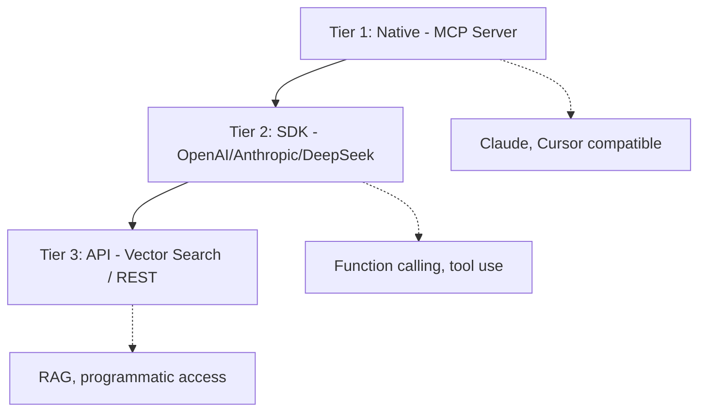
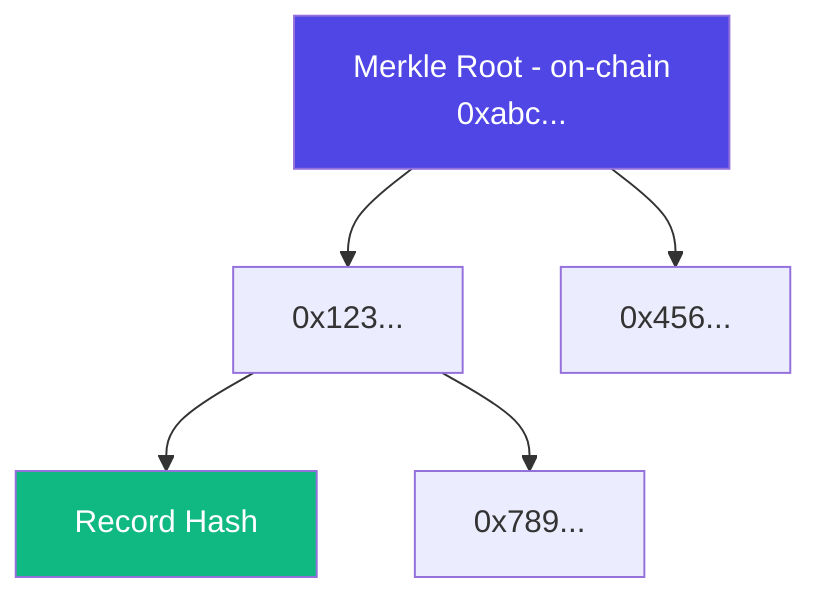

## Abstract

This document specifies the agent integration layer of Elastic Studio—the interfaces that enable AI agents to consume verified data programmatically. Unlike traditional data platforms that provide batch exports for human data scientists, Elastic Studio is built for machine-to-machine interaction: MCP servers for LLM toolchains, AI SDK integrations for major providers, and real-time vector search for RAG applications.

---

## 1. Design Philosophy

### 1.1 Agent-First Principles

Traditional data labeling platforms were designed around a human-centric workflow:

1. Data scientist exports labeled dataset
2. Downloads to local machine
3. Processes and transforms data
4. Loads into training pipeline

This workflow is fundamentally incompatible with AI agents, which require:

- **Real-time access:** Data available at query time, not export time
- **Programmatic consumption:** APIs and protocols, not file downloads
- **Quality signals:** Verification metadata to assess trustworthiness
- **Semantic retrieval:** Find relevant data by meaning, not just ID

### 1.2 Integration Hierarchy

Elastic Studio provides three tiers of integration, optimized for different agent architectures:



---

## 2. MCP Server Specification

### 2.1 Overview

The Model Context Protocol (MCP) is an open standard for connecting AI assistants to external data sources. Elastic Studio provides a native MCP server that exposes verified data as tools and resources.

**Why MCP First:**

- Native integration with Claude, Cursor, and growing ecosystem
- Bidirectional communication (not just request-response)
- Built-in context management for LLMs
- Standardized tool definitions

### 2.2 Transport Protocols

The MCP server supports two transport modes:

| Transport | Use Case                     | Latency | Connection     |
| --------- | ---------------------------- | ------- | -------------- |
| **stdio** | Local development, Cursor    | ~10ms   | Process pipe   |
| **SSE**   | Production, cloud deployment | ~50ms   | HTTP streaming |

### 2.3 Available Tools

The MCP server exposes the following tools:

**search_verified_data**

Semantic search across verified datasets with quality filtering.

```typescript
{
  name: "search_verified_data",
  description: "Search for verified, consensus-labeled data by semantic similarity",
  inputSchema: {
    type: "object",
    properties: {
      query: {
        type: "string",
        description: "Natural language search query"
      },
      dataset_id: {
        type: "string",
        description: "Optional: limit to specific dataset"
      },
      min_confidence: {
        type: "number",
        description: "Minimum consensus confidence (0-1)",
        default: 0.7
      },
      limit: {
        type: "number",
        description: "Maximum results to return",
        default: 10
      }
    },
    required: ["query"]
  }
}
```

**get_data_with_proof**

Retrieve specific data record with cryptographic verification proof.

```typescript
{
  name: "get_data_with_proof",
  description: "Get a verified data record with its consensus proof",
  inputSchema: {
    type: "object",
    properties: {
      record_id: {
        type: "string",
        description: "Unique identifier of the data record"
      },
      include_labeler_details: {
        type: "boolean",
        description: "Include contributing labeler information",
        default: false
      }
    },
    required: ["record_id"]
  }
}
```

**verify_data_quality**

Check quality metrics for a dataset or record without retrieving content.

```typescript
{
  name: "verify_data_quality",
  description: "Verify quality metrics for data without retrieving content",
  inputSchema: {
    type: "object",
    properties: {
      record_id: {
        type: "string",
        description: "Record ID to verify"
      },
      checks: {
        type: "array",
        items: {
          type: "string",
          enum: ["consensus_score", "labeler_count", "recency", "disputes"]
        },
        description: "Quality checks to perform"
      }
    },
    required: ["record_id"]
  }
}
```

**list_datasets**

Browse available verified datasets with metadata.

```typescript
{
  name: "list_datasets",
  description: "List available verified datasets",
  inputSchema: {
    type: "object",
    properties: {
      data_type: {
        type: "string",
        enum: ["text", "image", "audio", "video"],
        description: "Filter by data type"
      },
      min_records: {
        type: "number",
        description: "Minimum number of verified records"
      }
    }
  }
}
```

### 2.4 Resources

The MCP server also exposes read-only resources:

| Resource URI              | Description                     |
| ------------------------- | ------------------------------- |
| `elastic://datasets`      | List of all accessible datasets |
| `elastic://datasets/{id}` | Dataset metadata and schema     |
| `elastic://records/{id}`  | Individual verified record      |
| `elastic://stats`         | Platform statistics             |

### 2.5 Configuration

**Server Configuration (mcp.json):**

```json
{
  "mcpServers": {
    "elastic-studio": {
      "command": "npx",
      "args": ["@elastic-studio/mcp-server"],
      "env": {
        "ELASTIC_API_KEY": "your-api-key",
        "ELASTIC_ENDPOINT": "https://api.elasticstudio.io"
      }
    }
  }
}
```

---

## 3. AI SDK Integrations

### 3.1 OpenAI Integration

Elastic Studio data can be accessed via OpenAI's function calling:

**Function Definition:**

```python
tools = [
    {
        "type": "function",
        "function": {
            "name": "search_elastic_studio",
            "description": "Search for verified, human-labeled data from Elastic Studio",
            "parameters": {
                "type": "object",
                "properties": {
                    "query": {
                        "type": "string",
                        "description": "Search query for semantic matching"
                    },
                    "min_confidence": {
                        "type": "number",
                        "description": "Minimum consensus confidence threshold"
                    }
                },
                "required": ["query"]
            }
        }
    }
]
```

**Usage Example:**

```python
from openai import OpenAI
from elastic_studio import ElasticClient

client = OpenAI()
elastic = ElasticClient(api_key="...")

response = client.chat.completions.create(
    model="gpt-4",
    messages=[{"role": "user", "content": "What are the verified safety guidelines for..."}],
    tools=tools,
    tool_choice="auto"
)

# Handle tool call
if response.choices[0].message.tool_calls:
    tool_call = response.choices[0].message.tool_calls[0]
    args = json.loads(tool_call.function.arguments)

    # Query Elastic Studio
    results = elastic.search(
        query=args["query"],
        min_confidence=args.get("min_confidence", 0.7)
    )

    # Return verified data to model
    # Results include consensus_score, labeler_count, verification_proof
```

### 3.2 Anthropic Integration

For Claude's tool use capability:

**Tool Definition:**

```python
tools = [
    {
        "name": "query_verified_data",
        "description": "Query verified, consensus-labeled data from Elastic Studio. Use this when you need factual information that has been verified by multiple human labelers.",
        "input_schema": {
            "type": "object",
            "properties": {
                "query": {
                    "type": "string",
                    "description": "Natural language query"
                },
                "require_proof": {
                    "type": "boolean",
                    "description": "Include cryptographic verification proof"
                }
            },
            "required": ["query"]
        }
    }
]
```

**Usage Example:**

```python
import anthropic
from elastic_studio import ElasticClient

client = anthropic.Anthropic()
elastic = ElasticClient(api_key="...")

response = client.messages.create(
    model="claude-sonnet-4-20250514",
    max_tokens=1024,
    tools=tools,
    messages=[{"role": "user", "content": "Find verified information about..."}]
)

# Process tool use
for block in response.content:
    if block.type == "tool_use":
        results = elastic.search(
            query=block.input["query"],
            include_proof=block.input.get("require_proof", False)
        )
        # Continue conversation with verified data
```

### 3.3 DeepSeek Integration

DeepSeek-compatible function calling:

```python
from openai import OpenAI  # DeepSeek uses OpenAI-compatible API

client = OpenAI(
    api_key="your-deepseek-key",
    base_url="https://api.deepseek.com"
)

# Same function calling pattern as OpenAI
response = client.chat.completions.create(
    model="deepseek-chat",
    messages=[...],
    tools=tools  # Same tool definitions
)
```

---

## 4. Vector Database Integration

### 4.1 Semantic Search Architecture

Elastic Studio maintains a vector index of all verified data for semantic retrieval:


### 4.2 Embedding Models

| Data Type | Model                  | Dimensions |
| --------- | ---------------------- | ---------- |
| Text      | text-embedding-3-large | 3072       |
| Images    | CLIP ViT-L/14          | 768        |
| Audio     | Whisper embeddings     | 1280       |
| Code      | CodeBERT               | 768        |

### 4.3 Search API

**Endpoint:** `POST /v1/search`

**Request:**

```json
{
  "query": "How to handle user authentication securely",
  "embedding": null,
  "filters": {
    "dataset_id": "security-guidelines-v2",
    "min_confidence": 0.8,
    "max_age_days": 30,
    "data_type": "text"
  },
  "limit": 10,
  "include_vectors": false,
  "include_proof": true
}
```

**Response:**

```json
{
  "results": [
    {
      "id": "rec_abc123",
      "content": "Authentication should use...",
      "label": {
        "category": "security_best_practice",
        "confidence": 0.92
      },
      "metadata": {
        "consensus_score": 0.95,
        "labeler_count": 5,
        "consensus_timestamp": "2024-12-20T10:30:00Z"
      },
      "similarity": 0.89,
      "verification_proof": {
        "merkle_root": "0x...",
        "proof_path": ["0x...", "0x..."],
        "block_number": 12345678
      }
    }
  ],
  "total": 42,
  "query_id": "q_xyz789"
}
```

---

## 5. Response Format

### 5.1 Verified Data Response

Every data response includes verification metadata:

```typescript
interface VerifiedDataResponse {
  // Core data
  id: string;
  content: any;
  label: Label;

  // Verification metadata
  verification: {
    consensus_score: number; // 0-1, weighted agreement
    labeler_count: number; // Number of contributing labelers
    consensus_timestamp: string; // When consensus was reached
    dispute_count: number; // Number of disputes (if any)

    // Cryptographic proof
    proof: {
      merkle_root: string; // Root hash of consensus tree
      proof_path: string[]; // Path to verify inclusion
      block_number: number; // On-chain attestation block
      tx_hash: string; // Transaction hash
    };
  };

  // Quality signals
  quality: {
    avg_labeler_reputation: number; // Average rep of contributors
    time_to_consensus: number; // Seconds to reach consensus
    confidence_variance: number; // Variance in labeler confidence
  };
}
```

### 5.2 Verification Proof Structure

The verification proof allows agents to independently verify data authenticity:



---

## 6. Payment Integration

### 6.1 Current Model

Data access is billed based on query volume:

| Access Type                  | Price (ELASTIC) |
| ---------------------------- | --------------- |
| Search query                 | 0.005           |
| Record retrieval             | 0.001           |
| Verification proof           | 0.002           |
| Bulk export (per 1K records) | 0.50            |

### 6.2 x402 Micropayment Protocol (Coming Soon)

Future integration with the x402 protocol will enable true per-query micropayments:

```
Agent ──▶ Request with x402 header ──▶ Elastic Studio
      ◀── 402 Payment Required ◀──
      ──▶ Payment proof ──▶
      ◀── Data + Verification ◀──
```

**Benefits:**

- No subscription overhead
- Pay only for data consumed
- Automatic royalty distribution to labelers
- Privacy-preserving payment proofs

---

## 7. Rate Limits and Quotas

| Tier       | Queries/min | Records/day | Concurrent |
| ---------- | ----------- | ----------- | ---------- |
| Free       | 10          | 1,000       | 2          |
| Developer  | 100         | 50,000      | 10         |
| Enterprise | 1,000       | Unlimited   | 100        |
| Custom     | Negotiated  | Negotiated  | Negotiated |

---

## 8. Security Considerations

### 8.1 API Key Management

- Keys are scoped to specific datasets and operations
- Rotate keys regularly; revocation is immediate
- Use environment variables, never hardcode

### 8.2 Data Access Control

- Dataset-level access permissions
- Row-level security for sensitive data
- Audit logs for all access

### 8.3 Proof Verification

Agents should verify proofs before trusting data:

```python
from elastic_studio import verify_proof

result = elastic.get_data_with_proof(record_id)

# Verify the cryptographic proof
is_valid = verify_proof(
    content=result.content,
    label=result.label,
    proof=result.verification.proof,
    expected_root=result.verification.proof.merkle_root
)

if not is_valid:
    raise SecurityError("Data verification failed")
```

---

## 9. Getting Started

### 9.1 Quick Start (MCP)

1. Install the MCP server:

   ```bash
   npm install -g @elastic-studio/mcp-server
   ```

2. Configure in your MCP client (Cursor, Claude Desktop):

   ```json
   {
     "mcpServers": {
       "elastic-studio": {
         "command": "elastic-studio-mcp",
         "env": {
           "ELASTIC_API_KEY": "your-key"
         }
       }
     }
   }
   ```

3. Use in conversations:
   > "Search Elastic Studio for verified information about..."

### 9.2 Quick Start (Python SDK)

```bash
pip install elastic-studio
```

```python
from elastic_studio import ElasticClient

client = ElasticClient(api_key="your-key")

# Search verified data
results = client.search(
    query="authentication best practices",
    min_confidence=0.8
)

for result in results:
    print(f"Content: {result.content}")
    print(f"Confidence: {result.verification.consensus_score}")
    print(f"Verified by: {result.verification.labeler_count} labelers")
```
