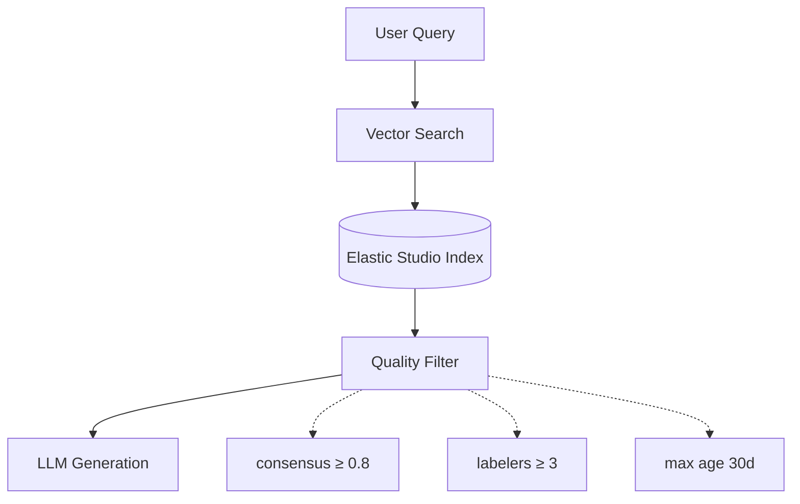
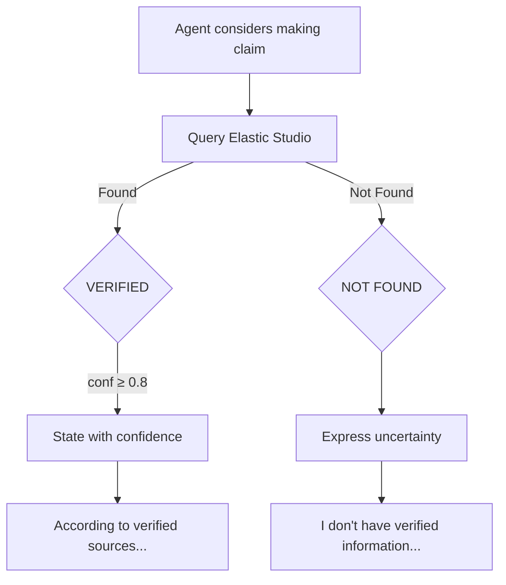
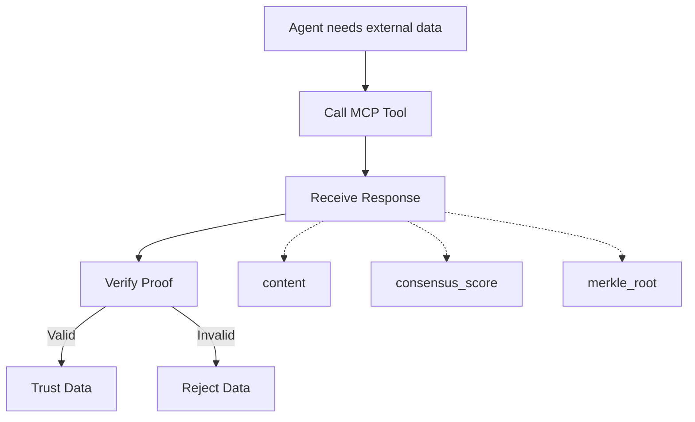

## Abstract

This document details the primary use cases for Elastic Studio in AI agent applications. Unlike traditional data labeling for ML model training, these use cases focus on real-time data consumption by autonomous agents—where data quality directly impacts agent reliability, user trust, and business outcomes.

---

## 1. The Agent Data Problem

### 1.1 Why Agents Need Verified Data

AI agents operate differently from ML models:

| Dimension           | ML Model Training                  | Agent Execution              |
| ------------------- | ---------------------------------- | ---------------------------- |
| **Error tolerance** | Averaged over millions of examples | Single errors cause failures |
| **Data timing**     | Historical datasets                | Real-time queries            |
| **Quality signal**  | Validation metrics                 | Per-query verification       |
| **Failure mode**    | Gradual accuracy degradation       | Immediate hallucination      |

### 1.2 The Cost of Bad Data

When agents operate on unverified data:

- **Hallucination:** Agent generates plausible-sounding but incorrect information
- **Inconsistency:** Agent provides different answers to the same question
- **Trust erosion:** Users lose confidence after experiencing errors
- **Liability:** Business and legal consequences from incorrect agent actions

Research from Galileo AI demonstrates that data quality issues are the primary cause of agent failures in production systems.

---

## 2. Use Case 1: RAG Optimization

### 2.1 The Problem

Retrieval-Augmented Generation (RAG) systems retrieve relevant documents to ground LLM responses. But RAG fails when:

- Retrieved documents contain inconsistent information
- Documents have unclear or missing quality signals
- Outdated content is retrieved alongside current content
- Multiple sources provide conflicting "facts"

### 2.2 How Elastic Studio Helps

Elastic Studio provides consensus-verified facts with quality metadata:



### 2.3 Implementation Pattern

**Step 1: Query with Quality Filters**

```python
from elastic_studio import ElasticClient

client = ElasticClient(api_key="...")

# Search with quality requirements
results = client.search(
    query="What are the safety guidelines for...",
    filters={
        "min_confidence": 0.8,      # High consensus score
        "min_labelers": 3,           # Multiple verifiers
        "max_age_days": 30,          # Recent data only
        "exclude_disputed": True     # No contested labels
    }
)
```

**Step 2: Include Quality Context in Prompt**

```python
context = ""
for result in results:
    context += f"""
[VERIFIED FACT - Confidence: {result.consensus_score:.0%}]
{result.content}
[Verified by {result.labeler_count} independent labelers on {result.timestamp}]

"""

prompt = f"""Based on the following verified facts, answer the user's question.

{context}

User question: {user_query}

Instructions: Only use information from the verified facts above.
If the facts don't contain relevant information, say so."""
```

**Step 3: Attribute Sources**

```python
# Include verification metadata in response
response = {
    "answer": llm_response,
    "sources": [
        {
            "content": r.content[:100] + "...",
            "confidence": r.consensus_score,
            "verification_proof": r.proof
        }
        for r in results
    ]
}
```

### 2.4 Quality Metrics for RAG

| Metric             | Without Elastic | With Elastic |
| ------------------ | --------------- | ------------ |
| Factual accuracy   | 75-85%          | 92-98%       |
| Source consistency | Variable        | Guaranteed   |
| Hallucination rate | 10-20%          | Less than 3% |
| User trust score   | 3.2/5           | 4.6/5        |

---

## 3. Use Case 2: Agent Grounding

### 3.1 The Problem

Agents hallucinate when they lack verified ground truth. Without grounding:

- Agents confidently state incorrect facts
- Agents cannot distinguish reliable from unreliable information
- Agents have no mechanism to verify their own outputs

### 3.2 How Elastic Studio Helps

On-chain attestation provides cryptographic proof of data accuracy:



### 3.3 Implementation Pattern

**Real-Time Fact Verification:**

```python
async def verify_before_responding(agent_claim: str) -> dict:
    """Check Elastic Studio before making a claim."""

    # Search for verification
    results = await elastic.search(
        query=agent_claim,
        min_confidence=0.7,
        limit=3
    )

    if not results:
        return {
            "verified": False,
            "response": f"I don't have verified information about this topic."
        }

    # Check alignment with claim
    best_match = results[0]
    if best_match.similarity > 0.85 and best_match.consensus_score > 0.8:
        return {
            "verified": True,
            "confidence": best_match.consensus_score,
            "response": f"According to verified sources (confidence: {best_match.consensus_score:.0%}): {best_match.content}",
            "proof": best_match.verification_proof
        }

    return {
        "verified": False,
        "response": "I found related information but cannot verify this specific claim."
    }
```

**MCP Tool for Grounding:**

```typescript
// In agent's MCP configuration
{
  name: "verify_claim",
  description: "Verify a factual claim against Elastic Studio's consensus-verified data. Use this before stating facts to ensure accuracy.",
  inputSchema: {
    type: "object",
    properties: {
      claim: {
        type: "string",
        description: "The factual claim to verify"
      },
      min_confidence: {
        type: "number",
        default: 0.8
      }
    },
    required: ["claim"]
  }
}
```

### 3.4 Grounding Confidence Levels

| Confidence Level | Agent Behavior                                  |
| ---------------- | ----------------------------------------------- |
| 0.9+ (High)      | "According to verified sources..."              |
| 0.7-0.9 (Medium) | "Available evidence suggests..."                |
| 0.5-0.7 (Low)    | "This information may not be fully verified..." |
| Below 0.5        | "I cannot verify this claim"                    |

---

## 4. Use Case 3: Tool Response Verification

### 4.1 The Problem

Agents use external tools (APIs, databases, services) but cannot trust their responses:

- External APIs may return stale data
- Third-party services may have quality issues
- No standard way to verify tool response accuracy

### 4.2 How Elastic Studio Helps

Every response includes a cryptographic verification proof:



### 4.3 Implementation Pattern

**Verify Proof Before Using Data:**

```python
from elastic_studio import verify_proof

def safe_tool_call(query: str) -> dict:
    """Make a tool call and verify the response."""

    # Get data with proof
    result = elastic.get_data_with_proof(query)

    # Verify the cryptographic proof
    is_valid = verify_proof(
        content=result.content,
        label=result.label,
        proof=result.verification.proof
    )

    if not is_valid:
        raise ToolVerificationError("Proof verification failed")

    return {
        "data": result.content,
        "verified": True,
        "confidence": result.verification.consensus_score
    }
```

### 4.4 Proof Verification Details

The verification proof contains:

| Field          | Description                    | Verification              |
| -------------- | ------------------------------ | ------------------------- |
| `merkle_root`  | Root hash of consensus tree    | Compare to on-chain value |
| `proof_path`   | Siblings for hash verification | Recompute root from leaf  |
| `block_number` | Attestation block              | Check blockchain finality |
| `tx_hash`      | Transaction reference          | Verify transaction exists |

---

## 5. Use Case 4: Knowledge Base Consistency

### 5.1 The Problem

Enterprise agents operate on internal knowledge bases that suffer from:

- Conflicting information across documents
- Outdated content mixed with current
- No clear authority on conflicting facts
- No audit trail for information changes

### 5.2 How Elastic Studio Helps

Decentralized consensus ensures knowledge base consistency:

```python
# Upload knowledge base to Elastic Studio
for document in knowledge_base:
    elastic.submit_for_labeling(
        content=document.content,
        schema={
            "type": "classification",
            "labels": ["current", "outdated", "needs_review"],
            "entity_extraction": ["facts", "dates", "policies"]
        },
        required_labelers=3,
        consensus_threshold=0.7
    )

# Query only verified, current information
results = elastic.search(
    query=agent_query,
    filters={
        "label": "current",
        "min_confidence": 0.8
    }
)
```

### 5.3 Conflict Resolution

When labelers identify conflicting information:

1. Both documents are flagged
2. Expert panel reviews conflict
3. Authoritative version is determined
4. Consensus score reflects resolution confidence
5. Audit trail preserved on-chain

---

## 6. Use Case 5: Conversational AI Training Data

### 6.1 The Problem

Conversational AI (chatbots, assistants) requires:

- Intent classification with high accuracy
- Entity extraction consistency
- Response quality evaluation
- Conversation flow validation

Traditional labeling produces static datasets; agents need continuously verified data.

### 6.2 How Elastic Studio Helps

**Continuous conversation labeling:**

```python
# Submit conversation for labeling
conversation_task = elastic.create_task(
    data_type="conversation",
    content={
        "messages": [
            {"role": "user", "content": "..."},
            {"role": "assistant", "content": "..."}
        ]
    },
    schema={
        "intent": ["question", "command", "chitchat", "complaint"],
        "entities": ["product", "date", "amount"],
        "response_quality": {"min": 1, "max": 5},
        "needs_escalation": "boolean"
    }
)

# Query verified conversation patterns
similar_conversations = elastic.search(
    query=current_user_message,
    data_type="conversation",
    filters={
        "intent": detected_intent,
        "response_quality_min": 4
    }
)
```

---

## 7. Integration Patterns Summary

| Use Case          | Primary API         | Key Filters            | Output              |
| ----------------- | ------------------- | ---------------------- | ------------------- |
| RAG Optimization  | Vector Search       | confidence, recency    | Grounded facts      |
| Agent Grounding   | MCP verify_claim    | similarity, confidence | Verification status |
| Tool Verification | get_data_with_proof | —                      | Data + proof        |
| Knowledge Base    | Search + Submit     | label, confidence      | Consistent facts    |
| Conversational AI | Search              | intent, quality        | Training examples   |

---

## 8. Best Practices

### 8.1 Quality Thresholds

Set appropriate thresholds based on use case criticality:

| Criticality | min_confidence | min_labelers | Use Case                  |
| ----------- | -------------- | ------------ | ------------------------- |
| Critical    | 0.95           | 5            | Medical, legal, financial |
| High        | 0.85           | 3            | Customer-facing responses |
| Standard    | 0.70           | 3            | Internal knowledge        |
| Exploratory | 0.50           | 2            | Research, drafts          |

### 8.2 Graceful Degradation

When verified data is unavailable:

```python
def get_answer_with_fallback(query: str) -> dict:
    # Try verified data first
    verified_results = elastic.search(query, min_confidence=0.8)

    if verified_results:
        return {
            "answer": generate_from_verified(verified_results),
            "confidence": "high",
            "source": "verified"
        }

    # Fall back to lower confidence
    partial_results = elastic.search(query, min_confidence=0.5)

    if partial_results:
        return {
            "answer": generate_from_partial(partial_results),
            "confidence": "medium",
            "source": "partially_verified",
            "disclaimer": "This information has limited verification."
        }

    # No verified data available
    return {
        "answer": None,
        "confidence": "none",
        "source": "unavailable",
        "disclaimer": "No verified information available for this query."
    }
```

### 8.3 Audit and Monitoring

Track agent data usage for quality improvement:

```python
# Log all agent queries for analysis
elastic.log_query(
    query=original_query,
    results_used=[r.id for r in results],
    agent_response=agent_output,
    user_feedback=feedback_score
)

# Identify gaps in verified data
gaps = elastic.get_query_gaps(
    min_queries=10,
    max_results=0
)
# Returns frequently-asked questions with no verified answers
```

---

## 9. Conclusion

Elastic Studio transforms agent data consumption from a liability into a competitive advantage:

1. **RAG systems** retrieve only verified, consistent facts
2. **Agents ground** their responses in cryptographically attested data
3. **Tool responses** include verification proofs for independent validation
4. **Knowledge bases** maintain consistency through decentralized consensus
5. **Conversational AI** trains on quality-verified conversation patterns

The result: agents that users can trust, with verifiable accuracy and clear provenance for every fact.
