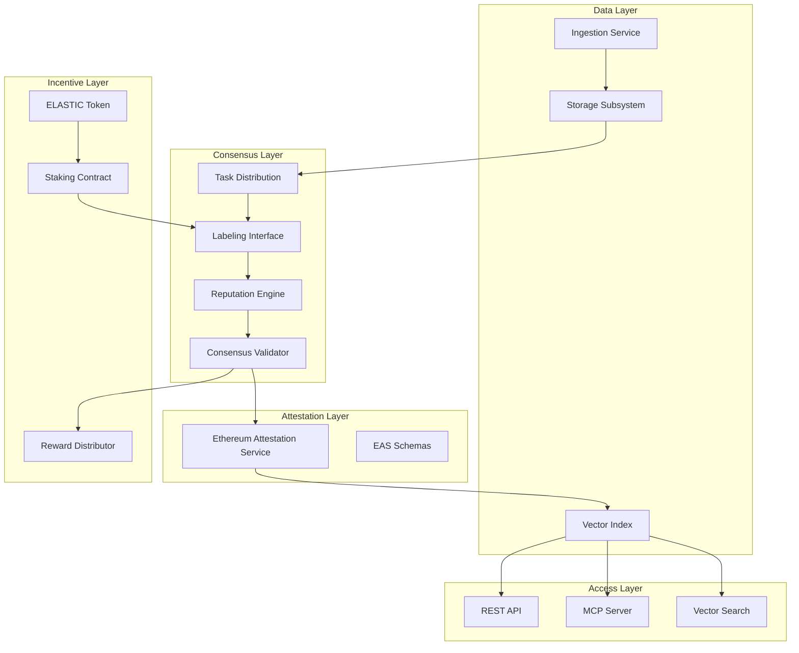
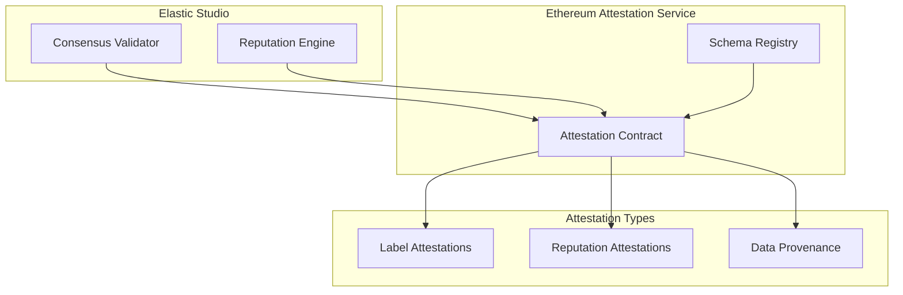
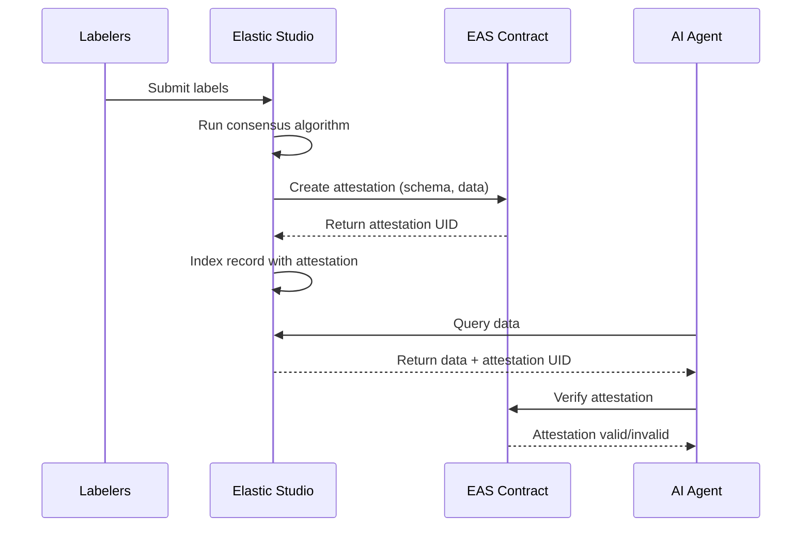

Elastic Studio implements a four-layer architecture designed for scalability, transparency, and agent-native data access. Each layer has well-defined responsibilities and interfaces.

## Architecture Overview



<Note>
  Elastic Studio leverages [Ethereum Attestation Service
  (EAS)](https://attest.org/) as the attestation infrastructure layer. EAS is a
  public good with 8.7M+ attestations that provides standardized, composable
  on-chain verification.
</Note>

---

## Layer 1: Data Layer

The Data Layer handles all data ingestion, storage, and indexing operations.

### Components

<AccordionGroup>
  <Accordion title="Ingestion Service" icon="cloud-arrow-up">
    **Responsibility**: Accept, validate, and process dataset uploads.
    
    **Interfaces**:
    | Endpoint | Method | Description |
    |----------|--------|-------------|
    | `/datasets` | POST | Create new dataset |
    | `/datasets/{id}/upload` | PUT | Upload data chunks |
    | `/datasets/{id}/finalize` | POST | Complete upload |
    
    **Processing pipeline**:
    1. Format validation
    2. Schema validation
    3. Content policy check
    4. Deduplication
    5. Chunking
    6. Task generation
    
    **Performance targets**:
    - Upload throughput: 100 MB/s
    - Validation latency: < 1 second/MB
    - Chunking latency: < 5 seconds/1000 records
  </Accordion>
  
  <Accordion title="Storage Subsystem" icon="database">
    **Responsibility**: Persistent storage for raw data and metadata.
    
    **Storage tiers**:
    
    | Tier | Data Type | Retention | Access Pattern |
    |------|-----------|-----------|----------------|
    | Hot | Active tasks | Indefinite | Random read |
    | Warm | Completed datasets | 1 year | Sequential read |
    | Cold | Archived | 7 years | Rare access |
    
    **Storage backends**:
    - Object storage (S3/GCS/Azure) for raw data
    - PostgreSQL for metadata and relationships
    - Redis for caching and sessions
    
    **Data model relationships**:
    
    ```
    Dataset (1) ──── (N) Task
    Task (1) ──── (N) Submission
    Task (1) ──── (1) ConsensusResult
    ConsensusResult (1) ──── (1) IndexedRecord
    ```
  </Accordion>
  
  <Accordion title="Vector Index" icon="magnifying-glass">
    **Responsibility**: Semantic search over finalized labels.
    
    **Index specification**:
    
    | Property | Value |
    |----------|-------|
    | Dimensions | 768–4096 (model-dependent) |
    | Distance metric | Cosine similarity |
    | Index type | HNSW (approximate) |
    | Recall target | >95% at top-10 |
    
    **Metadata filters**:
    - `dataset_id`: Exact match
    - `data_type`: Enum filter
    - `confidence`: Range filter \([0, 1]\)
    - `created_at`: Date range
    
    **Query capabilities**:
    - Vector similarity search
    - Hybrid (vector + keyword)
    - Filtered search
    - Batch queries
  </Accordion>
</AccordionGroup>

### Data Flow Specification


---

## Layer 2: Consensus Layer

The Consensus Layer manages task distribution, labeling workflow, and quality assurance.

### Components

<AccordionGroup>
  <Accordion title="Task Distribution" icon="list-check">
    **Responsibility**: Assign tasks to eligible labelers optimally.
    **Assignment criteria**: | Factor | Weight | Description |
    |--------|--------|-------------| | Reputation | 40% | Historical accuracy |
    | Stake | 20% | Economic commitment | | Specialization | 30% | Domain
    expertise | | Recency | 10% | Recent activity | **Assignment algorithm**: 1.
    Filter by eligibility (stake, reputation thresholds) 2. Score all eligible
    labelers 3. Select top 20% as candidate pool 4. Randomly sample \(N\) from
    pool **Constraints**: - No duplicate assignments per task - No same-labeler
    for same dataset within window - Geographic diversity (optional)
  </Accordion>

{" "}

<Accordion title="Labeling Interface" icon="pen-to-square">
  **Responsibility**: Present tasks and collect annotations. **Supported
  annotation types**: | Type | Data | UI Component |
  |------|------|--------------| | Classification | Text, Image | Radio/Checkbox
  | | NER | Text | Span highlighter | | Bounding Box | Image | Canvas drawer | |
  Segmentation | Image | Polygon tool | | Transcription | Audio, Video | Text
  editor + player | | Q&A | Text | Paired text fields | **UX requirements**: -
  Keyboard shortcuts for common actions - Undo/redo support - Auto-save drafts -
  Mobile responsive
</Accordion>

{" "}

<Accordion title="Reputation Engine" icon="star">
  **Responsibility**: Calculate and maintain labeler reputation scores.
  **Reputation model** (see [Consensus Mechanism](/elastic-studio/consensus)):
  $$ R = 1000 \cdot (\alpha A + \beta C + \gamma Q + \delta T) \cdot D $$
  **Update triggers**: - Task consensus finalized - Honeypot task completed -
  Dispute resolved - Inactivity timeout **Persistence**: - On-chain: Current
  score, tier - Off-chain: Historical data, detailed metrics
</Accordion>

  <Accordion title="Consensus Validator" icon="check-double">
    **Responsibility**: Aggregate labels and determine final truth. **Consensus
    methods**: | Label Type | Method | Formula |
    |------------|--------|---------| | Classification | Weighted vote |
    \(\arg\max W(L)\) | | Bounding box | IoU averaging | Weighted centroid | |
    Text span | Overlap clustering | Boundary voting | | Free-form | Embedding
    clustering | Similarity grouping | **Threshold specification**: - Default:
    \(\theta = 0.70\) - Range: \([0.50, 0.95]\) - Configurable per dataset
  </Accordion>
</AccordionGroup>

### State Machine


---

## Layer 3: Incentive Layer

The Incentive Layer implements cryptoeconomic mechanisms via smart contracts.

### Contract Architecture


### Smart Contracts

<AccordionGroup>
  <Accordion title="ELASTIC Token" icon="coins">
    **Standard**: ERC-20 **Properties**: | Property | Value |
    |----------|-------| | Name | Elastic Studio Token | | Symbol | ELASTIC | |
    Decimals | 18 | | Max Supply | 1,000,000,000 | | Mintable | No (fixed
    supply) | | Burnable | Yes | **Functions**: - Standard ERC-20 (transfer,
    approve, etc.) - `burn(amount)`: Destroy tokens - `burnFrom(account,
    amount)`: Approved burn
  </Accordion>

{" "}

<Accordion title="Staking Contract" icon="lock">
  **Responsibility**: Manage token staking for labeling access. **State
  variables**: | Variable | Type | Description |
  |----------|------|-------------| | `stakes` | mapping | Address → stake info
  | | `totalStaked` | uint256 | Sum of all stakes | | `minStake` | uint256 |
  Minimum stake (1000) | | `unstakeDelay` | uint256 | Cooldown period (7 days) |
  **Functions**: - `stake(amount, lockPeriod)`: Deposit tokens -
  `unstake(amount)`: Withdraw tokens - `getStakeTier(address)`: Return tier
  (0-3) - `slash(address, percentage, reason)`: Reduce stake **Events**: -
  `Staked(address, amount, lockPeriod)` - `Unstaked(address, amount)` -
  `Slashed(address, amount, reason)`
</Accordion>

{" "}

<Accordion title="Reward Distributor" icon="hand-holding-dollar">
  **Responsibility**: Calculate and distribute rewards. **Reward types**: | Type
  | Source | Trigger | |------|--------|---------| | Labeling | Task escrow |
  Consensus reached | | Royalties | Access fees | Daily aggregation | | Staking
  yield | Emissions | Continuous accrual | **Distribution formula**: $$ r_i =
  \text{base} \cdot m_R \cdot m_S \cdot m_A $$ See [Token
  Economics](/elastic-studio/tokenomics) for multiplier definitions.
</Accordion>

  <Accordion title="Governance" icon="landmark">
    **Responsibility**: Protocol parameter management. **Governable
    parameters**: | Parameter | Range | Cooldown |
    |-----------|-------|----------| | Protocol fee | 5-30% | 30 days | | Min
    stake | 100-10K | 14 days | | Consensus threshold | 50-90% | 14 days | |
    Staking APY | 0-50% | 7 days | **Voting specification**: - Proposal
    threshold: 100,000 ELASTIC - Quorum: 4% of supply - Voting period: 7 days -
    Timelock: 2 days
  </Accordion>
</AccordionGroup>

### Economic Parameters

| Parameter      | Value             | Rationale                           |
| -------------- | ----------------- | ----------------------------------- |
| Min stake      | 1,000 ELASTIC     | Sybil resistance                    |
| Max stake tier | 1,000,000 ELASTIC | Reward cap                          |
| Protocol fee   | 5-20%             | Sustainability                      |
| Slash rates    | 10-100%           | Deterrence proportional to severity |

---

## Attestation Layer: Ethereum Attestation Service (EAS)

Elastic Studio integrates [Ethereum Attestation Service (EAS)](https://attest.org/) as the attestation infrastructure layer. EAS is a public good infrastructure with 8.7M+ attestations that provides standardized, composable on-chain verification.

### Why EAS?

| Dimension               | Custom Solution    | EAS Integration             |
| ----------------------- | ------------------ | --------------------------- |
| Development cost        | High               | Minimal                     |
| Security audits         | Required           | Already audited             |
| Ecosystem composability | None               | Full Ethereum ecosystem     |
| Agent recognition       | Custom integration | Standard attestation format |
| Multi-chain support     | Complex            | Built-in (Ethereum, L2s)    |

### EAS Architecture



### EAS Schemas

Elastic Studio registers the following schemas with EAS:

<AccordionGroup>
  <Accordion title="Label Consensus Schema" icon="check-circle">
    **Schema UID**: `0x...` (registered on deployment) **Fields**: | Field |
    Type | Description | |-------|------|-------------| | `recordId` | bytes32 |
    Unique record identifier | | `datasetId` | bytes32 | Parent dataset | |
    `labelHash` | bytes32 | Hash of finalized label | | `consensusScore` |
    uint16 | Weighted agreement (0-10000 = 0-100%) | | `labelerCount` | uint8 |
    Number of contributing labelers | | `merkleRoot` | bytes32 | Root of labeler
    submissions tree | **Usage**: Created when a task reaches consensus.
    Provides cryptographic proof that a label was verified by multiple
    independent labelers.
  </Accordion>

{" "}

<Accordion title="Labeler Reputation Schema" icon="star">
  **Schema UID**: `0x...` (registered on deployment) **Fields**: | Field | Type
  | Description | |-------|------|-------------| | `labeler` | address | Labeler
  wallet address | | `reputation` | uint16 | Current reputation score (0-1000) |
  | `tasksCompleted` | uint32 | Total tasks completed | | `accuracyRate` |
  uint16 | Historical accuracy (0-10000) | | `stakeTier` | uint8 | Current stake
  tier (0-3) | | `lastUpdate` | uint64 | Timestamp of last update | **Usage**:
  Updated periodically to reflect labeler performance. Enables agents to verify
  labeler credibility.
</Accordion>

  <Accordion title="Data Provenance Schema" icon="file-certificate">
    **Schema UID**: `0x...` (registered on deployment) **Fields**: | Field |
    Type | Description | |-------|------|-------------| | `dataHash` | bytes32 |
    Hash of original data | | `uploaderId` | bytes32 | Data provider identifier
    | | `uploadTimestamp` | uint64 | When data was uploaded | | `schemaHash` |
    bytes32 | Hash of labeling schema | | `contentType` | string | Data type
    (text, image, etc.) | **Usage**: Created when data is uploaded. Establishes
    chain of custody for data provenance.
  </Accordion>
</AccordionGroup>

### Attestation Flow



### On-chain vs Off-chain Attestations

EAS supports both on-chain and off-chain attestations. Elastic Studio uses a hybrid approach:

| Attestation Type | Storage   | Cost     | Use Case                        |
| ---------------- | --------- | -------- | ------------------------------- |
| Label Consensus  | On-chain  | ~50K gas | High-value datasets, compliance |
| Label Consensus  | Off-chain | Free     | Standard datasets               |
| Reputation       | On-chain  | ~30K gas | Periodic snapshots              |
| Data Provenance  | On-chain  | ~40K gas | All uploads                     |

**Off-chain attestations** are stored on IPFS with the attestation hash anchored on-chain, providing the same verification guarantees at lower cost.

### Integration Code

**Creating a label attestation:**

```solidity
// Elastic Studio Attester Contract
import { IEAS, AttestationRequest } from "@ethereum-attestation-service/eas-contracts";

contract ElasticAttester {
    IEAS public eas;
    bytes32 public labelSchemaUID;

    function attestLabel(
        bytes32 recordId,
        bytes32 datasetId,
        bytes32 labelHash,
        uint16 consensusScore,
        uint8 labelerCount,
        bytes32 merkleRoot
    ) external returns (bytes32) {
        return eas.attest(AttestationRequest({
            schema: labelSchemaUID,
            data: AttestationRequestData({
                recipient: address(0), // No specific recipient
                expirationTime: 0,     // No expiration
                revocable: false,      // Immutable
                refUID: bytes32(0),
                data: abi.encode(
                    recordId,
                    datasetId,
                    labelHash,
                    consensusScore,
                    labelerCount,
                    merkleRoot
                ),
                value: 0
            })
        }));
    }
}
```

**Verifying attestation (agent-side):**

```typescript
import { EAS } from "@ethereum-attestation-service/eas-sdk";

const eas = new EAS(EAS_CONTRACT_ADDRESS);
eas.connect(provider);

// Verify attestation from Elastic Studio response
const attestation = await eas.getAttestation(attestationUID);

if (attestation.revoked) {
  throw new Error("Attestation has been revoked");
}

// Decode and verify data
const decodedData = eas.decodeAttestationData(attestation);
console.log(`Consensus Score: ${decodedData.consensusScore / 100}%`);
console.log(`Verified by: ${decodedData.labelerCount} labelers`);
```

### Composability Benefits

EAS attestations are composable with the broader Ethereum ecosystem:

1. **DeFi Integration**: Use label quality attestations as collateral scoring inputs
2. **Identity Systems**: Labeler reputation attestations work with ENS, Lens, etc.
3. **DAO Governance**: Reputation attestations can grant voting power in other protocols
4. **Agent Networks**: Standard attestation format recognized across agent ecosystems

---

## Layer 4: Access Layer

The Access Layer provides interfaces for data consumers.

### API Gateway

**Base URL**: `https://api.elasticstudio.io/v1`

**Authentication**: Bearer token (API key)

**Rate limiting**:

| Plan       | Requests/min | Daily quota |
| ---------- | ------------ | ----------- |
| Free       | 10           | 1,000       |
| Starter    | 100          | 50,000      |
| Pro        | 1,000        | 500,000     |
| Enterprise | Custom       | Custom      |

**Core endpoints**:

| Endpoint                 | Method | Description         |
| ------------------------ | ------ | ------------------- |
| `/datasets`              | GET    | List datasets       |
| `/datasets/{id}`         | GET    | Get dataset details |
| `/datasets/{id}/records` | GET    | Get labeled records |
| `/search`                | POST   | Semantic search     |
| `/export`                | POST   | Bulk export         |

### MCP Server

**Protocol**: Model Context Protocol (MCP)

**Transport**: stdio / SSE

**Capabilities**:

| Tool                   | Description       | Parameters               |
| ---------------------- | ----------------- | ------------------------ |
| `search_datasets`      | Semantic search   | query, filters, limit    |
| `get_dataset_info`     | Dataset metadata  | dataset_id               |
| `get_labeled_examples` | Retrieve examples | dataset_id, label, count |

**Resource URIs**:

- `elastic-studio://datasets/{id}`
- `elastic-studio://search?query={query}`

### Vector Search API

**Endpoint**: `POST /v1/vectors/search`

**Query types**:

| Type   | Input   | Description            |
| ------ | ------- | ---------------------- |
| Vector | float[] | Pre-computed embedding |
| Text   | string  | Auto-embedded query    |
| Hybrid | both    | Combined ranking       |

**Response**:

| Field                | Type   | Description      |
| -------------------- | ------ | ---------------- |
| `results`            | array  | Matched records  |
| `results[].id`       | string | Record ID        |
| `results[].score`    | float  | Similarity score |
| `results[].metadata` | object | Record metadata  |

---

## Technology Recommendations

### Backend Stack

| Component     | Recommendation        | Rationale               |
| ------------- | --------------------- | ----------------------- |
| API Framework | FastAPI               | Async, OpenAPI          |
| Database      | PostgreSQL 15+        | JSONB, reliability      |
| Cache         | Redis 7+              | Pub/sub, persistence    |
| Queue         | Redis Streams / Kafka | Ordering, replay        |
| Search        | Elasticsearch         | Full-text, aggregations |

### Blockchain Stack

| Component | Recommendation   | Rationale         |
| --------- | ---------------- | ----------------- |
| Network   | Base / Arbitrum  | Low gas, EVM      |
| Language  | Solidity 0.8.20+ | Industry standard |
| Framework | Foundry          | Testing, scripts  |
| Indexer   | The Graph        | Event queries     |

### Infrastructure

| Component     | Recommendation    | Rationale         |
| ------------- | ----------------- | ----------------- |
| Cloud         | AWS / GCP         | Global, reliable  |
| Orchestration | Kubernetes        | Scaling, recovery |
| CDN           | CloudFlare        | Edge, security    |
| Monitoring    | Datadog / Grafana | Observability     |

---

## Deployment Topology


### Scaling Considerations

| Component   | Scaling Strategy         | Trigger            |
| ----------- | ------------------------ | ------------------ |
| API Servers | Horizontal               | CPU > 70%          |
| Workers     | Horizontal               | Queue depth > 1000 |
| PostgreSQL  | Vertical + Read replicas | Connections > 80%  |
| Vector DB   | Sharding                 | Records > 10M      |
| Redis       | Cluster mode             | Memory > 80%       |

---

## Next Steps

<CardGroup cols={2}>
  <Card
    title="Consensus Mechanism"
    icon="scale-balanced"
    href="/elastic-studio/consensus"
  >
    Reputation-weighted consensus protocol
  </Card>

  <Card
    title="Data Flow"
    icon="diagram-project"
    href="/elastic-studio/data-flow"
  >
    End-to-end data lifecycle
  </Card>
</CardGroup>
