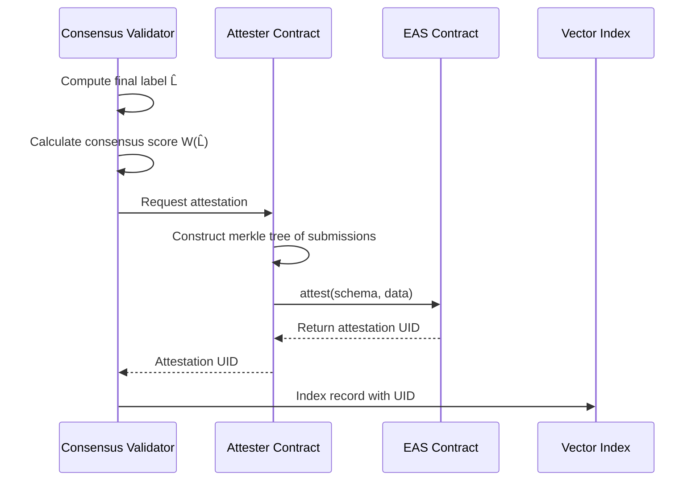

## Abstract

We present a Reputation-Weighted Consensus Protocol (RWCP) that achieves Byzantine fault tolerance in decentralized data labeling. Unlike traditional majority voting, RWCP weights participant votes by demonstrated competence, creating a meritocratic system where influence must be earned through accurate contributions. We prove that under honest majority assumptions, the protocol converges to correct labels with high probability.

---

## 1. Introduction

The fundamental challenge in decentralized data labeling is ensuring quality without centralized authority. Traditional crowdsourcing platforms solve this through employment relationships, contractual obligations, and manual quality assurance—mechanisms that do not translate to permissionless settings.

Elastic Studio addresses this through **cryptoeconomic consensus**: a mechanism design where producing correct labels is the economically dominant strategy. The key insight is that quality assurance becomes an equilibrium property rather than an enforcement problem.

**Core Thesis:** By requiring economic stake and weighting votes by demonstrated accuracy, we transform data labeling from a coordination problem (how to get workers to do good work) into an equilibrium problem (designing incentives where good work is the optimal strategy).

### 1.1 Design Requirements

A decentralized labeling consensus must satisfy:

1. **Correctness**: Honest majority produces correct labels
2. **Sybil Resistance**: Creating multiple identities provides no advantage
3. **Collusion Resistance**: Coordinated attacks are economically irrational
4. **Liveness**: All tasks eventually reach consensus
5. **Proportional Influence**: Voting power reflects demonstrated competence

### 1.2 Related Work

Our approach draws from several research areas:

**Byzantine Fault Tolerance (BFT):** Classical BFT systems tolerate up to f faulty nodes in 3f+1 total nodes. We adapt this to variable-weight voting where faulty "weight" rather than node count determines tolerance.

**Prediction Markets:** Hanson's market scoring rules demonstrate how economic stakes can aggregate dispersed information. RWCP applies similar principles to categorical judgments.

**Proof of Stake:** PoS blockchains weight validator influence by staked capital. We extend this with reputation to prevent pure plutocracy.

**Crowdsourcing Quality Control:** Dawid-Skene models and expectation maximization for aggregating noisy labels inform our statistical aggregation methods.

---

## 2. Formal Model

### 2.1 System Model

**Definition 1 (Labeling Task).** A task T is a tuple (D, Σ, N, θ) where:

- D is the data item requiring annotation
- Σ is the label space (valid outputs)
- N is the number of required labelers
- θ ∈ (0.5, 1] is the consensus threshold

**Definition 2 (Labeler).** A labeler ℓ is characterized by:

- Stake S_ℓ ≥ S_min (economic commitment)
- Reputation R_ℓ ∈ [0, 1000] (demonstrated competence)
- Accuracy A_ℓ ∈ [0, 1] (historical agreement with consensus)

**Definition 3 (Submission).** For task T, labeler ℓ submits:

- Label L_ℓ ∈ Σ
- Confidence c_ℓ ∈ [0, 1]
- Timestamp t_ℓ

### 2.2 Adversary Model

We consider a Byzantine adversary controlling a coalition C of labelers. The adversary can:

- Submit arbitrary labels (including strategically incorrect ones)
- Coordinate timing and label choices within coalition
- Create new identities (subject to stake requirements)

The adversary cannot:

- Forge signatures of honest labelers
- Modify on-chain state without proper transactions
- Predict random assignment selections

**Assumption (Honest Majority).** The total reputation of honest labelers exceeds that of adversarial labelers:

$$
\sum_{\ell \in H} R_\ell > \sum_{\ell \in C} R_\ell
$$

where H is the honest set and C is the adversarial coalition.

---

## 3. Reputation System

### 3.1 Reputation as Earned Trust

Reputation in RWCP serves a dual purpose:

1. **Quality Signal**: Higher reputation indicates demonstrated accuracy
2. **Vote Weight**: Reputation determines influence in consensus

This creates a feedback loop: accurate labeling increases reputation, which increases influence, which increases rewards for continued accuracy.

**Key Property:** Unlike stake (which can be purchased), reputation must be earned through demonstrated competence. This prevents pure plutocracy while maintaining economic accountability.

### 3.2 Reputation Computation

Reputation is computed as a weighted combination of performance metrics:

$$
R = 1000 \cdot (\alpha A + \beta C + \gamma Q + \delta T) \cdot D
$$

**Component Definitions:**

| Component      | Weight   | Description                           |
| -------------- | -------- | ------------------------------------- |
| A (Accuracy)   | α = 0.60 | Agreement rate with consensus         |
| C (Completion) | β = 0.20 | Task completion rate                  |
| Q (Quality)    | γ = 0.15 | Time consistency and pattern analysis |
| T (Tenure)     | δ = 0.05 | Platform experience bonus             |
| D (Decay)      | —        | Inactivity penalty multiplier         |

**Accuracy Score:**

The accuracy component measures rolling agreement over the last n tasks:

$$
A = \frac{1}{n} \sum_{k=1}^{n} \mathbb{1}[\text{agreed}_k]
$$

We use n = 100 to balance responsiveness with stability.

**Quality Score:**

The quality component detects anomalous behavior patterns:

$$
Q = \frac{1}{2}(Q_{\text{time}} + Q_{\text{consistency}})
$$

where:

- Q_time penalizes submissions that are suspiciously fast or slow
- Q_consistency measures deviation from historical labeling patterns

**Decay Factor:**

To encourage continuous participation, reputation decays with inactivity:

$$
D(d) = \begin{cases}
1.0 & \text{if } d \leq 7 \\
\max(0.5, 1.0 - 0.02(d - 7)) & \text{if } d > 7
\end{cases}
$$

where d is days since last activity.

### 3.3 Reputation Tiers

Labelers are classified into tiers based on reputation score:

| Tier        | Score Range | Vote Weight | Access Level        |
| ----------- | ----------- | ----------- | ------------------- |
| Novice      | 0–299       | 0.50×       | Training tasks only |
| Apprentice  | 300–499     | 0.75×       | Basic tasks         |
| Journeyman  | 500–699     | 1.00×       | Standard tasks      |
| Expert      | 700–849     | 1.25×       | Complex tasks       |
| Master      | 850–949     | 1.50×       | Review panels       |
| Grandmaster | 950–1000    | 2.00×       | Arbitration         |

**Rationale:** The tier system creates clear progression incentives while ensuring that critical functions (review, arbitration) are restricted to proven participants.

### 3.4 Reputation Update Dynamics

After each consensus determination, reputation is updated:

$$
R_{\text{new}} = \text{clamp}(R_{\text{old}} + \Delta R, 0, 1000)
$$

The update Δ R depends on agreement level:

| Agreement Level | Condition       | Update             |
| --------------- | --------------- | ------------------ |
| Strong Agree    | a ≥ 0.90        | +15 × (1 − R/1000) |
| Agree           | 0.70 ≤ a < 0.90 | +5 × (1 − R/1000)  |
| Disagree        | 0.30 ≤ a < 0.70 | −10 × (R/1000)     |
| Strong Disagree | a < 0.30        | −25 × (R/1000)     |

**Property (Diminishing Returns):** The (1 − R/1000) factor makes gains harder at higher reputation levels, while the (R/1000) factor in losses means high-reputation labelers have more to lose.

This creates a stable equilibrium where reaching top tiers requires sustained excellence, and maintaining top tier requires continued performance.

---

## 4. Consensus Protocol

### 4.1 Protocol Overview

The RWCP consensus protocol operates in three phases:

**Phase 1: Assignment**

- Select N eligible labelers for task T
- Eligibility requires: stake ≥ S_min, reputation ≥ R_min
- Selection includes randomization to prevent gaming

**Phase 2: Labeling**

- Each assigned labeler submits label L_i within time window
- System records submission metadata (timing, revisions)

**Phase 3: Aggregation**

- Compute reputation-weighted votes
- Determine consensus label if threshold met
- Escalate if threshold not met

### 4.2 Weighted Vote Aggregation

For a task with submissions \{(L_1, R_1), ..., (L_N, R_N)\}, we compute normalized weights:

$$
w_i = \frac{R_i}{\sum_{j=1}^{N} R_j}
$$

The weighted vote for label L is:

$$
W(L) = \sum_{i: L_i = L} w_i
$$

### 4.3 Consensus Determination

Consensus is reached when the winning label exceeds threshold θ:

$$
\hat{L} = \arg\max_{L \in \Sigma} W(L) \quad \text{subject to} \quad W(\hat{L}) \geq \theta
$$

**Consensus Outcomes:**

| Outcome    | Condition      | Action                     |
| ---------- | -------------- | -------------------------- |
| Consensus  | W(L̂) ≥ θ       | Finalize label             |
| Borderline | 0.5 ≤ W(L̂) < θ | Assign additional labelers |
| Deadlock   | W(L̂) < 0.5     | Escalate to review panel   |

### 4.4 Type-Specific Aggregation

Different label types require specialized aggregation:

**Categorical Labels (Classification):**
Standard weighted majority vote as described above.

**Spatial Labels (Bounding Boxes):**
For bounding boxes B_i = (x_i, y_i, w_i, h_i), we combine IoU-based clustering with weighted averaging:

$$
\hat{B} = \frac{\sum_i w_i^* \cdot B_i}{\sum_i w_i^*}
$$

where w_i\* incorporates both reputation and IoU agreement with other submissions.

**Span Labels (NER):**
Overlapping spans are clustered, then weighted boundaries and entity types are computed within each cluster.

**Free-form Text:**
Responses are embedded and clustered by semantic similarity. The highest-reputation submission from the dominant cluster is selected.

---

## 5. Security Analysis

### 5.1 Sybil Resistance

**Theorem 1 (Sybil Resistance).** Creating k identities provides no advantage over a single identity with equivalent stake.

_Proof:_ Vote weight is determined by reputation, not identity count. New identities begin at reputation 500 (Journeyman). Total voting weight of k new identities with stake S each equals k × (500/Σ R_j). A single identity with stake kS has reputation 500 and voting weight 500/Σ R_j. Since vote weight is independent of stake amount (only requiring S ≥ S_min), splitting stake across identities does not increase influence. □

**Corollary:** The attacker's optimal strategy is to concentrate stake in a single identity and build reputation through legitimate participation.

### 5.2 Collusion Resistance

**Theorem 2 (Collusion Cost).** Corrupting M tasks requires economic investment exceeding:

$$
C_{\text{attack}} \geq M \cdot \left\lceil \frac{N}{2} \right\rceil \cdot S_{\min} + T_{\text{rep}} \cdot \text{opportunity cost}
$$

where T_rep is the time required to build sufficient reputation.

_Proof sketch:_ To control consensus on a task, attackers need majority weighted vote. With threshold θ = 0.70 and N = 3 labelers, attackers need at least 2 high-reputation labelers per task. Each requires minimum stake S_min and time to build reputation. □

**Detection Mechanisms:**

Collusion is detected through:

1. **Statistical correlation**: Unusual agreement patterns between labeler pairs
2. **Timing analysis**: Synchronized submission times
3. **Behavioral clustering**: Similar error patterns across tasks

Detected colluders face coordinated slashing (50-100% of stake).

### 5.3 Byzantine Fault Tolerance

**Theorem 3 (BFT Guarantee).** Under honest majority assumption, RWCP produces correct labels with probability ≥ 1 − ε for arbitrarily small ε.

_Proof:_ Let R*H = Σ\{ℓ ∈ H\} R*ℓ be total honest reputation and R*C = Σ\{ℓ ∈ C\} R*ℓ be adversarial reputation. By assumption, R_H &gt; R_C.

In weighted voting, honest labelers contribute weight R_H/(R_H + R_C) &gt; 0.5. With consensus threshold θ ≥ 0.5, honest majority is sufficient to determine consensus.

For θ = 0.70 and honest labelers agreeing on correct label L, we have W(L) ≥ R_H/(R_H + R_C) &gt; 0.5. If honest labelers coordinate (which they do on correct labels), W(L) approaches R_H/(R_H + R_C).

As honest majority strengthens, P(consensus = correct) → 1. □

### 5.4 Economic Security Budget

The protocol maintains security through the **economic security budget**:

$$
\text{Security Budget} = \sum_{\ell \in \mathcal{L}} S_\ell \cdot P(\text{slash} | \text{attack})
$$

For the protocol to be secure, the cost of corruption must exceed potential gains:

$$
\text{Attack Cost} > \text{Attack Gain}
$$

With current parameters:

- S_min = 1,000 ELASTIC
- P(detection) ≈ 0.70
- Slash rate σ = 0.50 to 1.00

A rational attacker requires attack gain exceeding 1.7× the stake investment just to break even in expectation.

---

## 6. Slashing Mechanism

### 6.1 Purpose and Design

Slashing serves two functions:

1. **Deterrence**: The threat of stake loss discourages malicious behavior
2. **Compensation**: Slashed tokens fund protocol operations and compensate victims

**Design Principle:** Slashing is reserved for provably malicious behavior, not honest mistakes. The distinction matters: mistakes are addressed through reputation reduction; attacks through slashing.

### 6.2 Slashing Conditions

| Violation              | Evidence Required                         | Slash Rate |
| ---------------------- | ----------------------------------------- | ---------- |
| Sybil Attack           | Wallet clustering, behavioral fingerprint | 100%       |
| Collusion              | Statistical correlation ≥ 3σ              | 50–100%    |
| Spam/Random            | Entropy below threshold                   | 25%        |
| Persistent Low Quality | A < 0.30 over 50+ tasks                   | 10%        |

### 6.3 Slashing Economics

For labeler with stake S and violation with slash rate σ:

$$
\text{Slashed Amount} = \sigma \cdot S
$$

Distribution of slashed tokens:

- **50%** → Protocol treasury (insurance fund)
- **50%** → Burned (deflationary pressure)

The burn component creates positive externality for all token holders, aligning their interests with protocol security.

---

## 7. Dispute Resolution

### 7.1 Escalation Protocol

When consensus fails or is challenged, disputes are escalated:

**Level 1: Additional Labelers**

- Condition: 0.5 ≤ W(L̂) < θ
- Action: Assign N additional labelers
- Cost: Provider's escrow

**Level 2: Expert Panel**

- Condition: Dispute filed with 100 ELASTIC stake
- Action: 5 Grandmaster labelers review
- Resolution: 4/5 supermajority required

**Level 3: DAO Governance**

- Condition: Panel split or appeal filed
- Action: Token holder vote
- Resolution: Simple majority

### 7.2 Dispute Economics

The dispute system is designed to filter frivolous challenges:

- **Filing cost**: 100 ELASTIC (refunded if upheld)
- **Minimum reputation**: R ≥ 700 (Expert tier)
- **Reward if upheld**: 2× filing cost
- **Penalty if rejected**: Filing cost forfeited

This creates a separating equilibrium where only high-confidence disputes are filed.

---

## 8. Anti-Gaming Measures

### 8.1 Randomized Assignment

Task assignment includes controlled randomization:

1. Compute eligibility scores for all labelers
2. Form candidate pool (top 20% by score)
3. Sample N labelers uniformly from pool

The randomization in step 3 prevents deterministic assignment gaming while maintaining quality through step 2.

### 8.2 Honeypot Tasks

5% of tasks are honeypots with known ground truth. Honeypot performance is weighted 2× in accuracy calculation:

$$
A_{\text{adjusted}} = \frac{A_{\text{regular}} + 2 \cdot A_{\text{honeypot}}}{3}
$$

Honeypots are indistinguishable from regular tasks, forcing consistent effort.

### 8.3 Behavioral Analysis

The protocol monitors for anomalous patterns:

- Submission timing (too fast suggests random guessing)
- Error correlation (similar mistakes suggest collusion)
- Label distribution (deviation from expected frequencies)

Flagged behavior triggers additional scrutiny and potential investigation.

---

## 9. Protocol Parameters

| Parameter           | Symbol | Default       | Governance |
| ------------------- | ------ | ------------- | ---------- |
| Labelers per task   | N      | 3             | DAO vote   |
| Consensus threshold | θ      | 0.70          | DAO vote   |
| Minimum stake       | S_min  | 1,000 ELASTIC | DAO vote   |
| Accuracy weight     | α      | 0.60          | Fixed      |
| Honeypot rate       | —      | 5%            | Protocol   |
| Dispute stake       | —      | 100 ELASTIC   | DAO vote   |
| Decay start         | —      | 7 days        | Fixed      |

---

## 10. On-Chain Attestation via EAS

Upon consensus finalization, Elastic Studio creates an attestation using [Ethereum Attestation Service (EAS)](https://attest.org/). This provides cryptographic proof of the consensus result that agents and applications can independently verify.

### 10.1 Attestation Process



### 10.2 Attestation Data

Each label consensus creates an EAS attestation containing:

| Field            | Value                        | Purpose                  |
| ---------------- | ---------------------------- | ------------------------ |
| `recordId`       | hash(dataset_id, item_index) | Unique identifier        |
| `labelHash`      | keccak256(label_json)        | Label integrity          |
| `consensusScore` | W(L̂) × 10000                 | Quality signal (0-10000) |
| `labelerCount`   | N                            | Number of verifiers      |
| `merkleRoot`     | root(submissions)            | Verify individual labels |
| `timestamp`      | block.timestamp              | Temporal proof           |

### 10.3 Verification by Agents

Agents can verify attestations independently:

```python
from eas_sdk import EAS

# Initialize EAS client
eas = EAS(provider, EAS_CONTRACT_ADDRESS)

# Verify attestation from Elastic Studio response
attestation = eas.get_attestation(attestation_uid)

# Check validity
if attestation.revoked:
    raise Error("Attestation revoked")

# Decode data
data = eas.decode(attestation.data, LABEL_SCHEMA)
print(f"Consensus: {data['consensusScore'] / 100}%")
print(f"Labelers: {data['labelerCount']}")

# Verify label integrity
if keccak256(label_json) != data['labelHash']:
    raise Error("Label tampered")
```

### 10.4 Benefits of EAS Integration

| Benefit             | Description                                        |
| ------------------- | -------------------------------------------------- |
| **Standardization** | 8.7M+ attestations in ecosystem, recognized format |
| **Composability**   | Attestations work with other Ethereum protocols    |
| **Immutability**    | On-chain record cannot be altered                  |
| **Agent-Native**    | EAS explicitly supports agent interactions         |
| **Cost Efficiency** | Off-chain attestations with on-chain anchoring     |

---

## 11. Conclusion

The Reputation-Weighted Consensus Protocol provides a rigorous foundation for decentralized data labeling. By combining cryptoeconomic incentives with meritocratic influence, RWCP achieves quality assurance as an equilibrium property rather than an enforcement problem.

Key contributions:

1. **Formal model** for decentralized labeling consensus
2. **Reputation system** that earns trust through demonstrated competence
3. **Security proofs** showing Byzantine fault tolerance under honest majority
4. **Economic analysis** demonstrating attack resistance

The protocol is parameterized for flexibility, allowing governance to adjust sensitivity to evolving threat models while maintaining formal security guarantees.
