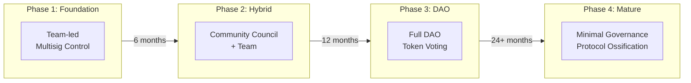
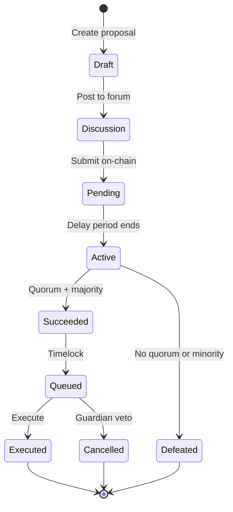
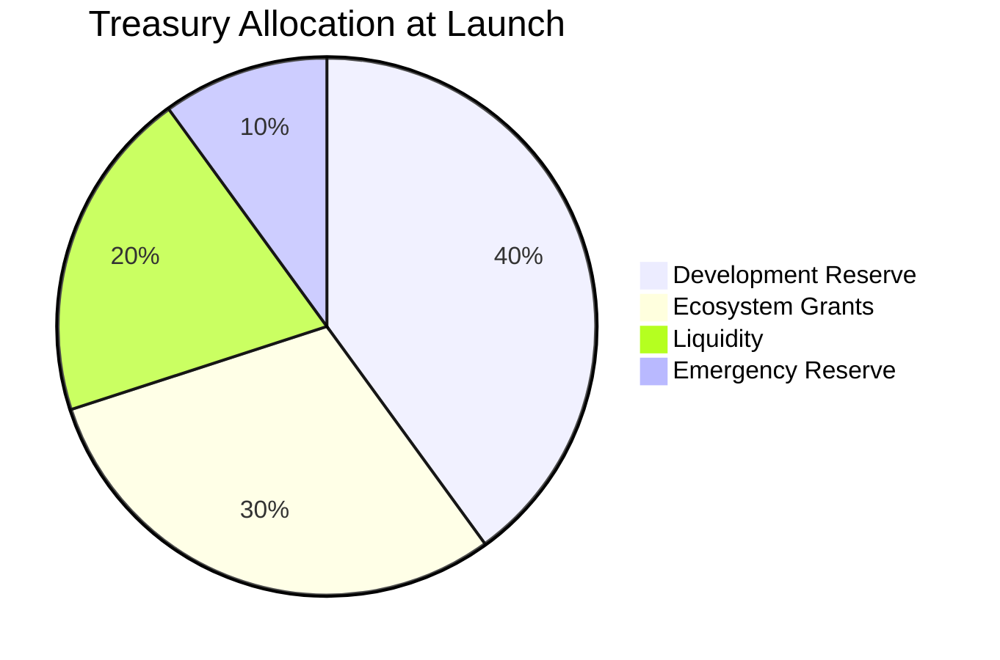

Elastic Studio implements a progressive decentralization model, transitioning from team-led governance to full community control. This document specifies the governance structure, voting mechanisms, and upgrade processes.

## Governance Philosophy

### Core Principles

<CardGroup cols={3}>
  <Card title="Stakeholder Alignment" icon="handshake">
    Governance power distributed to those with long-term commitment (stakers)
  </Card>
  
  <Card title="Gradual Decentralization" icon="timeline">
    Progressive transfer of control from team to community
  </Card>
  
  <Card title="Safety First" icon="shield">
    Conservative parameter bounds and timelocks prevent catastrophic changes
  </Card>
</CardGroup>

### Governance Scope

| Domain | Governance Control | Constraints |
|--------|-------------------|-------------|
| **Protocol parameters** | Full | Within defined bounds |
| **Treasury allocation** | Full | Subject to timelock |
| **Smart contract upgrades** | Partial | Guardian veto |
| **Fee structures** | Full | Maximum caps |
| **Slashing conditions** | Limited | Minimum thresholds |
| **Emergency actions** | None (Guardian only) | — |

---

## Governance Structure

### Progressive Decentralization Roadmap



### Phase 1: Foundation (Launch → 6 months)

**Governance model**: Team-controlled multisig

| Role | Control | Composition |
|------|---------|-------------|
| **Admin Multisig** | Protocol upgrades, parameters | 3-of-5 team members |
| **Treasury Multisig** | Fund allocation | 4-of-7 (3 team, 4 external) |
| **Guardian** | Emergency pause | 2-of-3 security team |

**Rationale**: Rapid iteration and bug fixes during early deployment.

### Phase 2: Hybrid (6 → 18 months)

**Governance model**: Community council + team

| Role | Control | Selection |
|------|---------|-----------|
| **Community Council** | Parameter proposals | Elected by token holders |
| **Team** | Technical implementation | Appointed |
| **Guardian** | Emergency veto | Multisig |

**Council composition**:
- 7 seats total
- 4 elected by token vote
- 2 appointed by team
- 1 rotating labeler representative

### Phase 3: Full DAO (18+ months)

**Governance model**: Token-weighted voting

| Mechanism | Specification |
|-----------|---------------|
| **Voting power** | 1 ELASTIC staked = 1 vote |
| **Proposal threshold** | 100,000 ELASTIC |
| **Quorum** | 4% of staked supply |
| **Voting period** | 7 days |
| **Timelock** | 2 days |

### Phase 4: Protocol Ossification (Long-term)

**Governance model**: Minimal governance, immutable core

- Core consensus mechanism becomes immutable
- Only peripheral parameters remain adjustable
- Emergency mechanisms preserved
- Focus shifts to application layer

---

## Voting Mechanism

### Proposal Lifecycle



### Proposal Types

<Tabs>
  <Tab title="Parameter Change">
    **Description**: Modify adjustable protocol parameters
    
    **Requirements**:
    - Proposal threshold: 100,000 ELASTIC
    - Quorum: 4%
    - Approval: >50%
    - Timelock: 2 days
    
    **Adjustable parameters**:
    
    | Parameter | Range | Cooldown |
    |-----------|-------|----------|
    | Protocol fee | 5-30% | 30 days |
    | Minimum stake | 100-10,000 | 14 days |
    | Consensus threshold | 0.5-0.9 | 14 days |
    | Staking APY | 0-50% | 7 days |
    | Labelers per task | 2-10 | 14 days |
  </Tab>
  
  <Tab title="Treasury Allocation">
    **Description**: Allocate treasury funds for specific purposes
    
    **Requirements**:
    - Proposal threshold: 250,000 ELASTIC
    - Quorum: 6%
    - Approval: >60%
    - Timelock: 7 days
    
    **Allocation categories**:
    
    | Category | Max per Proposal | Annual Cap |
    |----------|------------------|------------|
    | Development grants | 5M ELASTIC | 20M ELASTIC |
    | Marketing | 2M ELASTIC | 10M ELASTIC |
    | Liquidity | 10M ELASTIC | 30M ELASTIC |
    | Partnerships | 5M ELASTIC | 15M ELASTIC |
  </Tab>
  
  <Tab title="Protocol Upgrade">
    **Description**: Deploy new smart contract versions
    
    **Requirements**:
    - Proposal threshold: 500,000 ELASTIC
    - Quorum: 10%
    - Approval: >66%
    - Timelock: 14 days
    - Guardian non-veto
    
    **Process**:
    1. Code audit required
    2. Testnet deployment (7 days minimum)
    3. Proposal submission
    4. Voting period
    5. Timelock with guardian review
    6. Execution
  </Tab>
  
  <Tab title="Emergency Action">
    **Description**: Guardian-initiated emergency response
    
    **NOT subject to voting**:
    - Pause contracts
    - Freeze suspicious accounts
    - Activate circuit breakers
    
    **Post-hoc governance**:
    - Guardian actions must be ratified within 7 days
    - Unratified actions automatically reverse (if possible)
    - Guardian can be replaced by governance vote
  </Tab>
</Tabs>

### Voting Power Calculation

Voting power is determined by staked tokens with time-weighting:

$$
V_i = S_i \cdot \sqrt{\min(t_i, 365)}
$$

Where:
- S_i = tokens staked by address i
- t_i = days staked (capped at 365)

**Rationale**: Square root time factor rewards long-term commitment without creating excessive lock-in advantages.

### Delegation

Token holders can delegate voting power:

| Delegation Type | Description | Revocation |
|-----------------|-------------|------------|
| **Full delegation** | All votes to delegate | Instant |
| **Split delegation** | Divide among multiple delegates | Instant |
| **Conditional** | Delegate only for certain proposal types | Instant |

---

## Guardian Role

### Guardian Powers

The Guardian is a security-focused role with limited emergency powers:

| Power | Conditions | Scope |
|-------|------------|-------|
| **Pause contracts** | Suspected exploit | All contracts |
| **Veto proposals** | Security concerns | Protocol upgrades only |
| **Freeze accounts** | Evidence of attack | Individual accounts |
| **Activate circuit breakers** | Anomaly detection | Automatic |

### Guardian Constraints

<Warning>
Guardian powers are subject to significant constraints to prevent abuse.
</Warning>

| Constraint | Specification |
|------------|---------------|
| **Veto window** | 48 hours after proposal success |
| **Veto override** | 80% supermajority can override |
| **Pause duration** | Maximum 7 days without governance approval |
| **Guardian replacement** | 66% governance vote |
| **Action reporting** | All actions logged on-chain |

### Guardian Composition

| Phase | Composition | Threshold |
|-------|-------------|-----------|
| Phase 1 | 3 team security members | 2-of-3 |
| Phase 2 | 5 members (3 team, 2 external) | 3-of-5 |
| Phase 3+ | 7 members (2 team, 5 elected) | 4-of-7 |

---

## Governance Parameters

### Current Parameters

| Parameter | Value | Last Changed | Governance |
|-----------|-------|--------------|------------|
| Proposal threshold | 100,000 ELASTIC | Genesis | DAO vote |
| Quorum | 4% | Genesis | DAO vote |
| Voting period | 7 days | Genesis | DAO vote |
| Timelock | 2 days | Genesis | DAO vote |
| Guardian veto window | 48 hours | Genesis | DAO vote |

### Parameter Bounds

Governance can adjust parameters only within defined bounds:

| Parameter | Minimum | Maximum | Rationale |
|-----------|---------|---------|-----------|
| Proposal threshold | 10,000 | 1,000,000 | Accessibility vs. spam |
| Quorum | 1% | 20% | Participation vs. gridlock |
| Voting period | 3 days | 30 days | Speed vs. consideration |
| Timelock | 1 day | 30 days | Urgency vs. review |

---

## Treasury Management

### Treasury Composition



### Spending Authority

| Amount | Authority | Approval |
|--------|-----------|----------|
| Under 10,000 USD | Operations multisig | 2-of-3 |
| 10,000 - 100,000 USD | Treasury committee | 3-of-5 |
| 100,000 - 1,000,000 USD | Governance vote | Over 50%, 4% quorum |
| Over 1,000,000 USD | Governance vote | Over 60%, 6% quorum |

### Grant Program

**Categories**:

| Category | Focus | Typical Size |
|----------|-------|--------------|
| **Protocol development** | Core improvements | 50K - 500K USD |
| **Integrations** | Third-party tooling | 10K - 100K USD |
| **Research** | Academic studies | 25K - 200K USD |
| **Community** | Events, content | 5K - 50K USD |

**Process**:
1. Application submission
2. Committee review (2 weeks)
3. Community feedback (1 week)
4. Final decision
5. Milestone-based disbursement

---

## Upgrade Mechanisms

### Contract Upgradeability

<Tabs>
  <Tab title="Proxy Pattern">
    **Used for**: Core protocol contracts (Staking, Rewards)
    
    **Pattern**: Transparent proxy with admin
    
    ```
    User → Proxy → Implementation v1
                 ↓ (upgrade)
           → Implementation v2
    ```
    
    **Safeguards**:
    - Timelock on upgrades
    - Storage layout verification
    - Audit required
  </Tab>
  
  <Tab title="Immutable">
    **Used for**: Token contract, Reputation snapshots
    
    **Rationale**: Core token functionality should never change
    
    **Migration path**: Deploy new contract + migration period
  </Tab>
  
  <Tab title="Modular">
    **Used for**: Consensus algorithms, Access layer
    
    **Pattern**: Registry-based module system
    
    ```
    Registry → Module A (active)
             → Module B (deprecated)
             → Module C (pending)
    ```
    
    **Benefits**: Gradual rollout, easy rollback
  </Tab>
</Tabs>

### Upgrade Process

<Steps>
  <Step title="Development">
    Core team or community develops upgrade
  </Step>
  
  <Step title="Audit">
    Independent security audit required for all contract changes
  </Step>
  
  <Step title="Testnet">
    Minimum 7-day testnet deployment
  </Step>
  
  <Step title="Proposal">
    Submit governance proposal with:
    - Technical specification
    - Audit report
    - Testnet results
    - Migration plan
  </Step>
  
  <Step title="Voting">
    7-day voting period, 10% quorum, 66% approval
  </Step>
  
  <Step title="Timelock">
    14-day timelock with guardian review
  </Step>
  
  <Step title="Execution">
    Automated execution after timelock
  </Step>
</Steps>

---

## Dispute Resolution

### Governance Disputes

| Dispute Type | Resolution | Timeline |
|--------------|------------|----------|
| **Proposal validity** | Guardian ruling | 48 hours |
| **Vote counting** | On-chain verification | Immediate |
| **Quorum disputes** | Snapshot oracle | 24 hours |
| **Execution issues** | Technical review | 72 hours |

### Protocol Disputes

| Dispute Type | Resolution | Timeline |
|--------------|------------|----------|
| **Slashing appeals** | Grandmaster panel | 7 days |
| **Consensus challenges** | Re-labeling + review | 14 days |
| **Reward disputes** | Technical audit | 7 days |

---

## Legal Considerations

### Jurisdictional Structure

<Note>
**[To be finalized]** — Legal structure and regulatory compliance will be established prior to launch.
</Note>

**Anticipated structure**:
- Protocol development: Foundation (non-profit)
- Token issuance: Separate entity
- Operations: DAO-controlled treasury

### Regulatory Compliance

| Requirement | Approach |
|-------------|----------|
| **Securities regulations** | Token utility design, legal opinions |
| **AML/KYC** | Optional compliance layer for enterprises |
| **Data protection** | No PII stored on-chain |
| **Sanctions** | Address screening at access layer |

---

## Participation Guide

### How to Participate

<Steps>
  <Step title="Acquire ELASTIC">
    Purchase on exchanges or earn through labeling
  </Step>
  
  <Step title="Stake tokens">
    Stake in governance contract (minimum 1,000 ELASTIC)
  </Step>
  
  <Step title="Join discussion">
    Participate in forum discussions at forum.elasticstudio.io
  </Step>
  
  <Step title="Vote on proposals">
    Cast votes during active voting periods
  </Step>
  
  <Step title="Create proposals">
    With sufficient stake, submit your own proposals
  </Step>
</Steps>

### Governance Resources

| Resource | URL | Purpose |
|----------|-----|---------|
| Governance forum | forum.elasticstudio.io | Discussion |
| Voting app | vote.elasticstudio.io | Cast votes |
| Snapshot | snapshot.org/elasticstudio | Off-chain signaling |
| Documentation | docs.elasticstudio.io | This document |

---

## Next Steps

<CardGroup cols={2}>
  <Card title="Token Economics" icon="chart-line" href="/elastic-studio/tokenomics">
    Economic model details
  </Card>
  
  <Card title="Security Analysis" icon="shield-halved" href="/elastic-studio/security-analysis">
    Security model and guarantees
  </Card>
</CardGroup>

