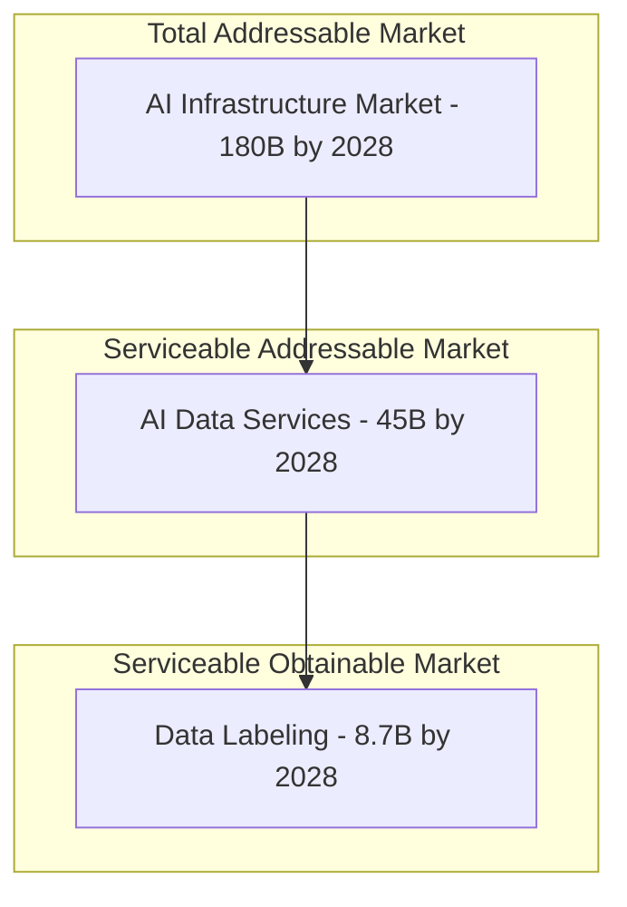
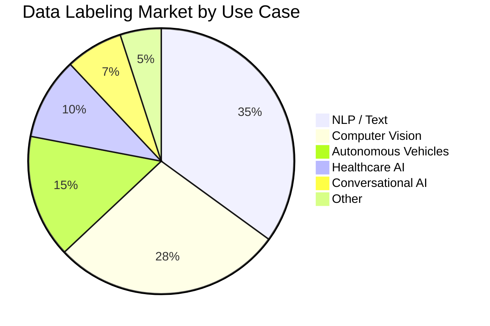
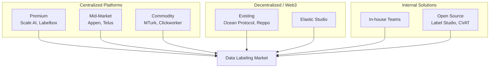
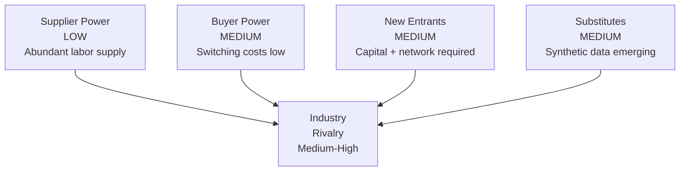
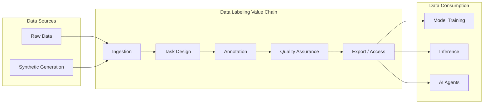
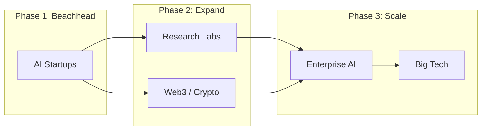

This section provides comprehensive analysis of the data labeling market, competitive positioning, and the emerging opportunity in AI-native data infrastructure.

## Market Size & Growth

### Total Addressable Market (TAM)

The data labeling market represents a critical component of the broader AI/ML infrastructure stack.

### Market Sizing

| Market Segment | 2024 | 2026 | 2028 | CAGR |
|----------------|------|------|------|------|
| **AI Infrastructure (TAM)** | 65B | 110B | 180B | 29% |
| **AI Data Services (SAM)** | 18B | 28B | 45B | 26% |
| **Data Labeling (SOM)** | 2.1B | 4.5B | 8.7B | 42% |
| **Decentralized Data (Target)** | 50M | 300M | 1.2B | 120% |

**Sources**: Gartner, IDC, Grand View Research, Internal Analysis

### Growth Drivers

<AccordionGroup>
  <Accordion title="Generative AI Explosion" icon="explosion">
    **Impact**: The rise of LLMs and multimodal models has dramatically increased demand for diverse, high-quality training data.
    
    | Model Type | Data Requirement | Growth Rate |
    |------------|------------------|-------------|
    | LLMs | 10T+ tokens | 10× per generation |
    | Vision models | 1B+ images | 5× per year |
    | Multimodal | Combined + paired | 20× per year |
    
    **Key insight**: Model capabilities scale with data quality and diversity, not just quantity.
  </Accordion>
  
  <Accordion title="AI Agent Proliferation" icon="robot">
    **Impact**: Autonomous AI agents require verified, real-time data access for decision-making.
    
    | Application | Data Needs | Market Size |
    |-------------|------------|-------------|
    | Coding assistants | Code + documentation | 5B by 2027 |
    | Customer service | Conversation + intent | 8B by 2027 |
    | Research agents | Scientific + citations | 3B by 2027 |
    
    **Key insight**: Agents need curated, verified data — not raw web scrapes.
  </Accordion>
  
  <Accordion title="Enterprise AI Adoption" icon="building">
    **Impact**: Enterprises are moving from AI experimentation to production deployment.
    
    | Adoption Stage | % of Enterprises | Data Spend |
    |----------------|------------------|------------|
    | Experimentation | 45% | Low |
    | Pilot projects | 35% | Medium |
    | Production | 15% | High |
    | AI-native | 5% | Very high |
    
    **Key insight**: Production AI requires domain-specific, high-quality labeled data.
  </Accordion>
  
  <Accordion title="Regulatory Requirements" icon="gavel">
    **Impact**: AI regulations (EU AI Act, etc.) mandate data quality documentation and traceability.
    
    | Requirement | Traditional | Elastic Studio |
    |-------------|-------------|----------------|
    | Data provenance | Manual documentation | On-chain records |
    | Quality metrics | Self-reported | Consensus confidence |
    | Bias auditing | Expensive studies | Transparent distributions |
    
    **Key insight**: Verifiable data quality becomes a compliance requirement.
  </Accordion>
</AccordionGroup>

---

## Market Segmentation

### By Data Type

| Segment | Market Share | Growth Rate | Key Players |
|---------|--------------|-------------|-------------|
| **Text** | 45% | 35% | Scale AI, Appen |
| **Image** | 30% | 45% | Labelbox, V7 |
| **Audio** | 12% | 50% | Rev.ai, Deepgram |
| **Video** | 8% | 55% | Supervisely |
| **Multimodal** | 5% | 80% | Emerging |

### By Use Case

### By Customer Segment

| Segment | Characteristics | Willingness to Pay | Volume |
|---------|-----------------|-------------------|--------|
| **Big Tech** | In-house capabilities, supplemental | Low | Very High |
| **AI Startups** | Speed-focused, quality-sensitive | Medium-High | Medium |
| **Enterprise** | Compliance needs, domain-specific | High | High |
| **Research** | Budget-constrained, quality-critical | Medium | Low |
| **Crypto/Web3** | Decentralization-native, early adopter | High | Low-Medium |

---

## Competitive Landscape

### Market Map

### Competitor Analysis

<Tabs>
  <Tab title="Scale AI">
    **Overview**: Market leader in managed data labeling services.
    
    | Dimension | Assessment |
    |-----------|------------|
    | **Strengths** | Enterprise relationships, diverse capabilities, quality processes |
    | **Weaknesses** | High prices, black-box quality, no token incentive |
    | **Market position** | Premium enterprise segment |
    | **Pricing** | 0.10 - 5.00 USD per label |
    | **Threat level** | Medium — different market segment |
    
    **Differentiation opportunity**: Transparent quality, lower costs, agent integration
  </Tab>
  
  <Tab title="Labelbox">
    **Overview**: Platform-focused, self-service data labeling tools.
    
    | Dimension | Assessment |
    |-----------|------------|
    | **Strengths** | Modern UI, ML-assisted labeling, integrations |
    | **Weaknesses** | Workforce management separate, quality varies |
    | **Market position** | Mid-market, developer-focused |
    | **Pricing** | 0.05 - 1.00 USD per label + platform fee |
    | **Threat level** | Medium — tools vs. protocol |
    
    **Differentiation opportunity**: Integrated workforce + quality guarantee
  </Tab>
  
  <Tab title="Amazon MTurk">
    **Overview**: Original crowdsourcing platform, commodity positioning.
    
    | Dimension | Assessment |
    |-----------|------------|
    | **Strengths** | Massive workforce, low prices, API access |
    | **Weaknesses** | Quality inconsistent, no accountability, spam |
    | **Market position** | Commodity, volume-focused |
    | **Pricing** | 0.01 - 0.10 USD per label |
    | **Threat level** | Low — different quality tier |
    
    **Differentiation opportunity**: Quality guarantee, economic accountability
  </Tab>
  
  <Tab title="Reppo Labs">
    **Overview**: Web3-native, prediction market approach to data quality.
    
    | Dimension | Assessment |
    |-----------|------------|
    | **Strengths** | Crypto-native, novel mechanism, early mover |
    | **Weaknesses** | Text-focused, limited UI, early stage |
    | **Market position** | Web3 niche |
    | **Pricing** | Token-based |
    | **Threat level** | Medium — similar thesis, different execution |
    
    **Differentiation opportunity**: Multimodal support, superior UX, agent integration
  </Tab>
  
  <Tab title="Label Studio">
    **Overview**: Open-source labeling tool, self-hosted.
    
    | Dimension | Assessment |
    |-----------|------------|
    | **Strengths** | Free, customizable, strong community, multimodal |
    | **Weaknesses** | No workforce, no quality assurance, ops burden |
    | **Market position** | Developer tools, OSS |
    | **Pricing** | Free (self-hosted) / Enterprise tiers |
    | **Threat level** | Low — complementary (we fork their UI) |
    
    **Differentiation opportunity**: Add workforce + incentive layer to proven UI
  </Tab>
</Tabs>

### Competitive Positioning Matrix

| Factor | Weight | Scale AI | Labelbox | MTurk | Reppo | Elastic Studio |
|--------|--------|----------|----------|-------|-------|----------------|
| Quality guarantee | 25% | 7 | 5 | 3 | 6 | 9 |
| Cost efficiency | 20% | 4 | 6 | 9 | 7 | 8 |
| Scalability | 15% | 7 | 7 | 9 | 6 | 8 |
| Transparency | 15% | 3 | 4 | 2 | 8 | 10 |
| Agent integration | 15% | 5 | 5 | 3 | 4 | 9 |
| Multimodal | 10% | 8 | 7 | 6 | 4 | 8 |
| **Weighted Score** | 100% | **5.6** | **5.5** | **5.1** | **5.9** | **8.7** |

---

## Market Dynamics

### Porter's Five Forces Analysis

<AccordionGroup>
  <Accordion title="Industry Rivalry (Medium-High)" icon="fire">
    **Assessment**: Fragmented market with several well-funded players competing on different dimensions.
    
    - Scale AI dominates enterprise
    - Labelbox strong in self-service
    - Many regional/specialized players
    - Price competition in commodity segment
    
    **Implication**: Differentiation through mechanism (not just features) is key
  </Accordion>
  
  <Accordion title="Supplier Power (Low)" icon="users">
    **Assessment**: Large global pool of potential labelers, no single supplier has leverage.
    
    - Millions of potential annotators worldwide
    - Skills are learnable (not specialized)
    - Platform creates value, not individual labelers
    
    **Implication**: Protocol design matters more than supplier relationships
  </Accordion>
  
  <Accordion title="Buyer Power (Medium)" icon="building">
    **Assessment**: Buyers have options but switching costs exist.
    
    - Low switching costs between platforms
    - BUT: data already labeled has value
    - Enterprise buyers want reliability
    - Quality requirements create stickiness
    
    **Implication**: Quality and reliability create retention
  </Accordion>
  
  <Accordion title="Threat of New Entrants (Medium)" icon="door-open">
    **Assessment**: Significant capital and network effects required.
    
    - Technology is replicable
    - Workforce networks take time to build
    - Reputation systems have cold-start problem
    - Regulatory complexity increasing
    
    **Implication**: First-mover advantage in crypto-native segment
  </Accordion>
  
  <Accordion title="Threat of Substitutes (Medium)" icon="wand-magic-sparkles">
    **Assessment**: Synthetic data and AI-assisted labeling are emerging.
    
    - LLMs can generate training data
    - BUT: hallucinations, bias, homogeneity issues
    - Hybrid approaches likely to dominate
    - Human verification still required
    
    **Implication**: Position as "verified" data, not commodity labeling
  </Accordion>
</AccordionGroup>

### Value Chain Analysis

**Value capture points**:

| Stage | Traditional Value | Elastic Studio Value |
|-------|-------------------|---------------------|
| Task design | Platform fee | Included in protocol |
| Annotation | Per-label fee | Staker rewards |
| Quality assurance | Hidden in price | Consensus mechanism (free) |
| Export / Access | One-time | Recurring royalties |

---

## Target Market Strategy

### Beachhead Market

**Primary target**: AI startups building agent applications

| Characteristic | Fit with Elastic Studio |
|----------------|------------------------|
| Technical sophistication | High — can integrate API/MCP |
| Budget constraints | Value cost-efficiency |
| Quality requirements | High — agents need reliable data |
| Decentralization affinity | Above average |
| Speed of adoption | Fast decision cycles |

### Expansion Path

### Go-to-Market Strategy

| Phase | Timeline | Focus | Channels | Success Metric |
|-------|----------|-------|----------|----------------|
| **1. Launch** | Q1-Q2 2025 | AI startups, crypto-native | Twitter, Discord, Dev relations | 100 active labelers |
| **2. Growth** | Q3-Q4 2025 | Research, Web3 | Conferences, partnerships | 10 enterprise customers |
| **3. Scale** | 2026+ | Enterprise | Sales team, case studies | 1M ARR |

---

## Market Risks

<Warning>
The following risks should be considered by potential investors and participants.
</Warning>

| Risk | Probability | Impact | Mitigation |
|------|-------------|--------|------------|
| **Synthetic data disruption** | Medium | High | Position as verification layer |
| **Regulatory changes** | Medium | Medium | Geographic diversification |
| **Competition from Big Tech** | Low | High | Decentralization moat |
| **Crypto market correlation** | High | Medium | Fiat payment options |
| **Quality at scale challenges** | Medium | High | Gradual scaling, reputation |

---

## Conclusion

The data labeling market presents a compelling opportunity for disruption:

1. **Large and growing** — 8.7B USD by 2028, 42% CAGR
2. **Structurally broken** — Current solutions fail on quality or cost
3. **Crypto-native gap** — No dominant player in decentralized segment
4. **Timing advantage** — AI agent explosion creates new demand

Elastic Studio is positioned to capture this opportunity through superior mechanism design, agent-native architecture, and first-mover advantage in the decentralized segment.

---

## Next Steps

<CardGroup cols={2}>
  <Card title="Token Economics" icon="chart-line" href="/elastic-studio/tokenomics">
    Economic model and incentive design
  </Card>
  
  <Card title="Technical Architecture" icon="sitemap" href="/elastic-studio/architecture">
    System design and implementation
  </Card>
</CardGroup>

