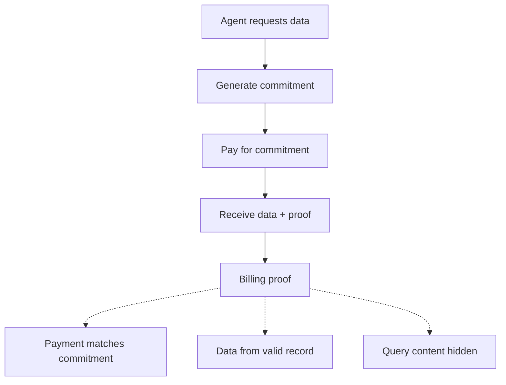
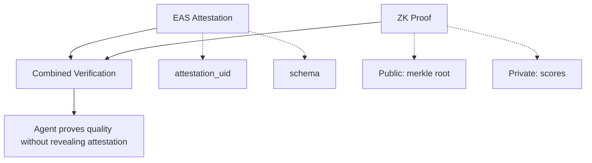

## Abstract

The ZK Access Layer enables privacy-preserving data access through zero-knowledge proofs. Agents can prove they accessed high-quality, verified data without revealing what data they accessed—enabling enterprise compliance, competitive intelligence protection, and privacy-preserving billing.

---

## 1. Motivation

### 1.1 The Privacy Paradox

Data access creates a fundamental tension:

- **Agents need verified data** to produce reliable outputs
- **Data consumers want privacy** about what they're querying
- **Labelers deserve royalties** for data usage
- **Compliance requires auditing** without exposing sensitive queries

Traditional access logs reveal:

- What data was accessed
- Who accessed it
- When and how often
- Patterns that expose business strategy

### 1.2 ZK Solution

Zero-knowledge proofs enable a new paradigm:

| Agent Proves               | Agent Keeps Private      |
| -------------------------- | ------------------------ |
| "I accessed verified data" | Which specific records   |
| "Data quality ≥ 0.9"       | Actual quality score     |
| "Data from last 24h"       | Exact timestamps         |
| "I paid for N queries"     | Query contents, identity |

---

## 2. ZK Proof Types

### 2.1 Access Validity Proof

Prove that accessed data came from Elastic Studio with sufficient quality, without revealing which records.

**Statement:**

$$
\text{Prove: } \exists \text{ record } r \in \text{ElasticStudio} : \\
\text{consensus\_score}(r) \geq \theta \land \\
\text{hash}(r) \in \text{MerkleTree}
$$

**What's Proven:**

- Data is from Elastic Studio (Merkle inclusion)
- Data meets quality threshold
- Access was authorized

**What's Hidden:**

- Specific record ID
- Record content
- Exact consensus score

### 2.2 Quality Threshold Proof

Prove data quality exceeds a threshold without revealing the exact score.

**Statement:**

$$
\text{Prove: } \text{consensus\_score}(r) \geq \theta
$$

**Use Cases:**

- Enterprise SLAs requiring minimum data quality
- Compliance audits without exposing specifics
- Customer assurance without revealing internals

### 2.3 Recency Proof

Prove data was labeled within a time window without revealing exact timestamps.

**Statement:**

$$
\text{Prove: } t_{\text{now}} - t_{\text{consensus}} \leq \Delta t
$$

**Use Cases:**

- Real-time data requirements
- Regulatory freshness mandates
- Time-sensitive applications

### 2.4 Usage Attestation Proof

Prove payment for N queries without revealing query contents or identity.

**Statement:**

$$
\text{Prove: } \text{payment\_commitment}(N, \text{blinded\_id}) \in \text{PaymentTree}
$$

**Use Cases:**

- Privacy-preserving billing
- Anonymous royalty distribution
- Usage auditing without tracking

---

## 3. Technical Implementation

### 3.1 Proof Systems

Elastic Studio supports multiple ZK proof systems:

| System      | Proof Size | Verification | Best For                         |
| ----------- | ---------- | ------------ | -------------------------------- |
| **Groth16** | 128 bytes  | ~1ms         | On-chain verification            |
| **PLONK**   | ~1KB       | ~3ms         | Flexibility, no trusted setup    |
| **STARK**   | ~50KB      | ~5ms         | Transparency, quantum resistance |

**Default:** Groth16 for production (smallest proofs, fastest verification)

### 3.2 Circuit Design

**Access Validity Circuit:**

```
Inputs:
├── Public
│   ├── merkle_root (from blockchain)
│   ├── min_confidence (threshold)
│   └── timestamp_bound
└── Private
    ├── record_content
    ├── record_label
    ├── consensus_score
    ├── merkle_proof_path
    └── consensus_timestamp

Constraints:
1. hash(record_content || record_label) == leaf_hash
2. verify_merkle_path(leaf_hash, proof_path, merkle_root) == true
3. consensus_score >= min_confidence
4. consensus_timestamp >= timestamp_bound
```

### 3.3 Proof Generation

Proofs are generated client-side to preserve privacy:

```python
from elastic_studio.zk import generate_access_proof

# Agent retrieves data (encrypted channel)
data = elastic.get_data_private(record_id)

# Generate ZK proof locally
proof = generate_access_proof(
    record=data,
    merkle_root=current_merkle_root,
    min_confidence=0.9,
    max_age_hours=24
)

# Proof can be shared without revealing data
print(f"Proof: {proof.hex()}")  # 128 bytes
print(f"Verifiable: {proof.verify()}")  # True
```

### 3.4 Verification

Proofs can be verified by anyone with the public inputs:

```python
from elastic_studio.zk import verify_proof

# Verifier only needs public inputs
is_valid = verify_proof(
    proof=proof_bytes,
    public_inputs={
        "merkle_root": "0x...",
        "min_confidence": 0.9,
        "timestamp_bound": 1703980800
    }
)
```

**On-chain verification:**

```solidity
// Verification on Ethereum
contract ElasticVerifier {
    function verifyAccess(
        bytes calldata proof,
        bytes32 merkleRoot,
        uint256 minConfidence,
        uint256 timestampBound
    ) external view returns (bool) {
        uint256[8] memory proofData = abi.decode(proof, (uint256[8]));
        uint256[3] memory publicInputs = [
            uint256(merkleRoot),
            minConfidence,
            timestampBound
        ];
        return verifyGroth16(proofData, publicInputs);
    }
}
```

---

## 4. Privacy-Preserving Billing

### 4.1 Problem

Traditional billing reveals:

- Which records were accessed
- Access patterns and frequency
- Business intelligence about queries

### 4.2 ZK Billing Protocol



### 4.3 Royalty Distribution

Labelers receive royalties without knowing who accessed their data:

```python
# Generate royalty proof
royalty_proof = generate_royalty_proof(
    access_proofs=[proof1, proof2, ...],
    labeler_contributions={
        "labeler_a": [record_ids_blinded],
        "labeler_b": [record_ids_blinded]
    }
)

# Distribute royalties based on proof
# Labelers see: "You earned X tokens from N accesses"
# Labelers don't see: Who accessed, which specific records
```

---

## 5. Enterprise Compliance

### 5.1 Audit Without Exposure

Enterprises can prove compliance without revealing sensitive queries:

**Scenario:** Enterprise must prove to auditor that all AI agent responses used verified data.

**Traditional approach:** Share access logs (exposes business strategy)

**ZK approach:**

```python
# Generate compliance proof
compliance_proof = generate_compliance_proof(
    agent_responses=responses,
    access_proofs=proofs,
    compliance_policy={
        "min_confidence": 0.8,
        "max_age_days": 30,
        "required_labelers": 3
    }
)

# Auditor verifies
audit_result = auditor.verify_compliance(
    proof=compliance_proof,
    policy=policy_hash
)
# Returns: "Compliant" without seeing any queries
```

### 5.2 Regulatory Use Cases

| Regulation | Requirement             | ZK Solution                                           |
| ---------- | ----------------------- | ----------------------------------------------------- |
| GDPR       | Prove data minimization | Prove access was necessary without revealing what     |
| SOC 2      | Audit data access       | Compliance proofs without exposing queries            |
| HIPAA      | Healthcare data audit   | Prove authorized access without revealing PHI queries |
| Financial  | Trading data audit      | Prove data source quality without exposing strategy   |

---

## 6. API Reference

### 6.1 Generate Access Proof

**Endpoint:** `POST /v1/zk/prove/access`

**Request:**

```json
{
  "record_ids": ["rec_123", "rec_456"],
  "min_confidence": 0.9,
  "max_age_hours": 24,
  "proof_system": "groth16"
}
```

**Response:**

```json
{
  "proof": "0x...",
  "public_inputs": {
    "merkle_root": "0x...",
    "min_confidence": 900000,
    "timestamp_bound": 1703980800
  },
  "verification_key": "0x..."
}
```

### 6.2 Verify Proof

**Endpoint:** `POST /v1/zk/verify`

**Request:**

```json
{
  "proof": "0x...",
  "public_inputs": {
    "merkle_root": "0x...",
    "min_confidence": 900000,
    "timestamp_bound": 1703980800
  }
}
```

**Response:**

```json
{
  "valid": true,
  "verification_time_ms": 1.2
}
```

### 6.3 Generate Billing Proof

**Endpoint:** `POST /v1/zk/prove/billing`

**Request:**

```json
{
  "payment_commitment": "0x...",
  "access_count": 100,
  "period_start": "2024-12-01T00:00:00Z",
  "period_end": "2024-12-31T23:59:59Z"
}
```

---

## 7. Performance Characteristics

### 7.1 Proof Generation (Client-Side)

| Operation                 | Time   | Memory |
| ------------------------- | ------ | ------ |
| Single access proof       | ~500ms | ~100MB |
| Batch proof (100 records) | ~2s    | ~500MB |
| Billing proof             | ~1s    | ~200MB |

### 7.2 Proof Verification

| System  | On-chain Gas | Off-chain Time |
| ------- | ------------ | -------------- |
| Groth16 | ~250K gas    | ~1ms           |
| PLONK   | ~350K gas    | ~3ms           |
| STARK   | ~500K gas    | ~5ms           |

### 7.3 Proof Sizes

| Proof Type          | Groth16   | PLONK | STARK |
| ------------------- | --------- | ----- | ----- |
| Access validity     | 128 bytes | 1KB   | 50KB  |
| Quality threshold   | 128 bytes | 1KB   | 50KB  |
| Batch (100 records) | 128 bytes | 1KB   | 60KB  |
| Billing proof       | 256 bytes | 2KB   | 80KB  |

---

## 8. Security Considerations

### 8.1 Trusted Setup (Groth16)

Groth16 requires a trusted setup ceremony:

- **Elastic Studio's approach:** Multi-party computation (MPC) with 100+ participants
- **Toxic waste:** Distributed and verifiably destroyed
- **Verification:** Public transcript of ceremony

### 8.2 Circuit Soundness

All circuits undergo:

1. Formal verification of constraint system
2. Third-party security audits
3. Bug bounty program for vulnerabilities

### 8.3 Privacy Guarantees

| Property           | Guarantee                                       |
| ------------------ | ----------------------------------------------- |
| **Zero-knowledge** | Proofs reveal nothing beyond statement validity |
| **Soundness**      | False proofs computationally infeasible         |
| **Completeness**   | Valid statements always produce valid proofs    |

---

## 9. Integration Example

### 9.1 Full ZK Access Flow

```python
from elastic_studio import ElasticClient
from elastic_studio.zk import ZKClient

# Initialize clients
elastic = ElasticClient(api_key="...")
zk = ZKClient()

# 1. Agent queries data (private channel)
results = elastic.search_private(
    query="authentication best practices",
    min_confidence=0.9
)

# 2. Generate ZK proof of valid access
access_proof = zk.prove_access(
    records=results,
    min_confidence=0.9,
    max_age_hours=24
)

# 3. Use data in agent response
agent_response = llm.generate(
    context=results,
    query=user_query
)

# 4. Attach proof to response (optional)
response_with_proof = {
    "answer": agent_response,
    "verification": {
        "proof": access_proof.hex(),
        "public_inputs": access_proof.public_inputs,
        "statement": "Response grounded in verified data (confidence ≥ 90%)"
    }
}

# 5. Anyone can verify without knowing what data was used
is_valid = zk.verify(access_proof)
```

---

## 10. Future Developments

### 10.1 Recursive Proofs

Aggregate multiple access proofs into a single proof:

$$
\text{RecursiveProof} = \text{Prove}(\text{Verify}(\pi_1) \land \text{Verify}(\pi_2) \land \ldots)
$$

### 10.2 Cross-Chain Verification

Verify proofs on multiple blockchains for broader accessibility.

### 10.3 Threshold ZK

Collaborative proof generation for multi-party agent systems:

$$
\text{ThresholdProof} = \text{Combine}(\text{Share}_1, \text{Share}_2, \ldots, \text{Share}_t)
$$

### 10.4 EAS + ZK Integration

Elastic Studio leverages [Ethereum Attestation Service (EAS)](https://attest.org/) for on-chain attestations. ZK proofs can reference EAS attestations to provide privacy-preserving verification:



**Benefits of EAS + ZK:**

| Dimension     | EAS Only            | ZK Only            | EAS + ZK            |
| ------------- | ------------------- | ------------------ | ------------------- |
| Verifiability | Public on-chain     | Proof verification | Both                |
| Privacy       | None (public)       | Full               | Full                |
| Composability | Ethereum ecosystem  | Custom             | Ecosystem + privacy |
| Cost          | Gas per attestation | Proof generation   | Optimized           |

**Example: Private verification of EAS attestation:**

```python
from elastic_studio.zk import ZKEASVerifier

# Create ZK proof that references EAS attestation
proof = ZKEASVerifier.prove_attestation_quality(
    attestation_uid="0x...",  # Private: which attestation
    min_consensus=0.9,         # Public: quality threshold
    eas_merkle_root="0x..."   # Public: current EAS state
)

# Verifier learns: "Agent accessed data with quality ≥ 90%"
# Verifier doesn't learn: which specific attestation/record
```

---

## 11. Conclusion

The ZK Access Layer represents a fundamental advancement in data access privacy. By leveraging zero-knowledge proofs, Elastic Studio enables:

1. **Privacy-preserving verification:** Prove data quality without exposing queries
2. **Anonymous billing:** Pay for access without revealing what was accessed
3. **Compliance auditing:** Demonstrate regulatory compliance without exposing business logic
4. **Royalty distribution:** Compensate labelers without tracking individual accesses

This enables enterprises to use AI agents with verified data while maintaining competitive confidentiality and regulatory compliance.
